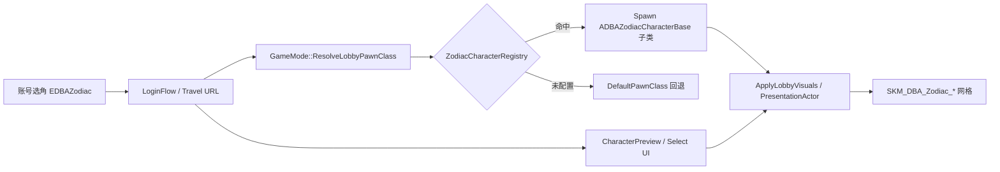

# 玩家十二生肖角色系统审查

> 项目：DivineBeastsArena（神兽竞技场）  
> 版本：0.3.0  
> 审查日期：2026-07-07  
> 状态：基于当前仓库源码与 CSV 源表，反映 Registry 数据驱动重构后的实现

---

## 1. 审查结论摘要

| 维度 | 现状 | 评价 |
|------|------|------|
| 代码架构 | 12 个生肖共用 `ADBAZodiacCharacterBase`，由 `UDBAZodiacCharacterRegistry` 数据资产映射到角色类 | 已脱离「每生肖一个 C++ 子类」模式，符合数据驱动策略 |
| 角色模型 | `Content/DBA/Zodiacs/Chinese/Visuals/Meshes/` 下 12 个 `SKM_DBA_Zodiac_*` 资产齐全 | 资源覆盖完整 |
| 数值与文案 | `DT_HeroBalance.csv`、`DT_SkillNames.csv` 源表齐全（各 12 行 / 72 行） | V15 定稿；**V2 战术技能见 `DT_ZodiacSkillDefinitions.csv`（60 行）** |
| 技能组 | `DT_FixedSkillGroups.csv` 60 行（12×5 元素） | MVP 自动生成行，数值与 AbilitySet 待策划补齐 |
| 运行时注册 | `UDBAZodiacCharacterRegistry` 已由 `DBAGameModeBase` 配置软引用接入 | `DA_DBA_ZodiacCharacterRegistry` 已保存，十二生肖均映射至通用 C++ 角色类 |
| 文档一致性 | `CharacterSystem_Architecture.md` 仍描述 12 个子类 | 已过时，本文档为生肖玩家角色权威说明 |

**核心设计原则（与代码注释一致）：**

- 生肖决定身份、外观基调、生肖大招来源；
- 生肖与自然元素、五大阵营解耦；
- 玩家不自由组合技能，固定技能组由 `Zodiac + Element` 查表生成。

---

## 2. 类层次与运行时链路

### 2.1 继承体系（当前）

```
ACharacter + IAbilitySystemInterface
└── ADBACharacterBase（抽象，死亡/队伍/ASC 接入点）
    └── ADBAZodiacCharacterBase（+ IIDBACharacterRef，玩家生肖唯一 C++ 基类）
```

**已移除（不再存在于源码树）：**

- `ADBAZodiacCharacter_{Rat,Ox,...,Pig}` × 12
- `UDBAZodiacAnimConfig_{Zodiac}` × 12

**替代方案：**

| 能力 | 新实现 |
|------|--------|
| 生肖 → 角色类 | `UDBAZodiacCharacterRegistry`（`TMap<EDBAZodiac, TSubclassOf<ADBAZodiacCharacterBase>>`） |
| 动画配置 | `UDBAZodiacAnimConfig_Generic`（单类 + `ZodiacType` 字段） |
| GAS 技能 | `UDBAZodiacPassiveAbility_Generic`、`UDBAZodiacUltimateAbility_Generic` 等泛型能力类 |
| 大厅生成 | `ADBAGameModeBase::ResolveLobbyPawnClass()` 读 Registry，失败回退 `DefaultPawnClass` |

### 2.2 关键源码路径

| 组件 | 路径 |
|------|------|
| 角色基类 | `DBA_GameClient/Source/DivineBeastsArena/Public/GameDBA/Character/DBACharacterBase.h` |
| 生肖基类 | `.../Public/GameDBA/Character/DBAZodiacCharacterBase.h` |
| 生肖注册表 | `.../Public/GameDBA/Character/Zodiac/DBAZodiacCharacterRegistry.h` |
| 角色引用接口 | `.../Public/GameDBA/Character/IDBACharacterRef.h` |
| 大厅 Pawn 解析 | `.../Private/GameDBA/Framework/DBAGameModeBase.cpp`（`ResolveLobbyPawnClass`） |
| 大厅展示网格 | `.../Private/GameDBA/UI/Lobby/Login/DBACharacterPresentationActor.cpp` |
| 英雄聚合数据 | `.../Public/GameDBA/Data/DBAZodiacHeroDataAsset.h` |
| 技能组子系统 | `.../Public/GameDBA/Services/DBASkillGroupGeneratorSubsystem.h` |
| 技能名称子系统 | `.../Public/GameDBA/Data/DBASkillNameSubsystem.h` |
| 英雄平衡子系统 | `.../Public/GameDBA/GAS/Balance/DBAHeroBalanceSubsystem.h` |

### 2.3 生成与展示流程



---

## 3. 枚举与命名约定

### 3.1 双枚举（需注意转换）

| 枚举 | 模块 | 用途 |
|------|------|------|
| `EDBAZodiac` | GameCore | 账号、会话、Travel、Registry、后端契约 |
| `EDBAZodiacType` | DivineBeastsArena | GAS、HUD、部分 Arena 逻辑 |

二者成员一一对应（`Rat`…`Pig`），但 **无统一转换工具类**，多处手写 `switch`（如 `DBAPlayableSkillComponent`、`UDBALobbyPlayerHUDWidgetBase`）。

### 3.2 DataTable 行名约定

| 表 | 行名格式 | 示例 |
|----|----------|------|
| `DT_HeroBalance` | `{Zodiac}` | `Rat`, `Ox` |
| `DT_SkillNames` | `{Zodiac}_{Slot}` | `Rat_Skill01`, `Rat_Ultimate` |
| `DT_FixedSkillGroups` | `{Zodiac}_{Element}` | `Rat_Water`, `Tiger_Fire` |
| `ZodiacHeroDisplayTable`（HeroDataAsset） | `Zodiac_{Name}` | `Zodiac_Rat` |
| 固定技能组 ID（Build） | `{Zodiac}_{Element}` | 与 FixedSkillGroups 一致 |

元素在 CSV 中使用 `Gold`（非 `Metal`）；共鸣结构体字段名仍含 `Metal*` 历史命名。

### 3.3 技能槽位

| 槽位索引 | 名称 | 说明 |
|----------|------|------|
| 0 | Passive | 被动 |
| 1–4 | Skill01–Skill04 | 主动技能（元素技能，随 Element 变化） |
| 5 | Ultimate | 生肖大招（同一生肖各元素共用 `{Zodiac}_Ultimate`） |

---

## 4. 十二生肖角色清单（审查主表）

以下为 **`DT_HeroBalance.csv` + `DT_SkillNames.csv`** 的权威展示数据（V15 定稿）。  
评级为 1–5 分：生存 / 伤害 / 控制 / 机动 / 辅助 / 难度 / 团战影响。

| # | 枚举 | 全名 | 简称 | 定位 | 生 | 伤 | 控 | 机 | 辅 | 难 | 团 | 推荐路线 | 大招 |
|---|------|------|------|------|:--:|:--:|:--:|:--:|:--:|:--:|:--:|----------|------|
| 1 | Rat | 子鼠·夜影灵牙 | 影牙 | 潜行刺客 / 侦察收割 | 2 | 5 | 2 | 5 | 2 | 5 | 3 | 打野 / 游走 | 子夜现身 |
| 2 | Ox | 丑牛·撼山铁角 | 铁角 | 重装坦克 / 开团先锋 | 5 | 2 | 5 | 2 | 4 | 3 | 5 | 上路 / 辅助前排 | 蛮牛开山 |
| 3 | Tiger | 寅虎·啸山白虎 | 白虎 | 爆发战士 / 目标压制 | 3 | 5 | 3 | 4 | 1 | 4 | 4 | 上路 / 打野 | 白虎点将 |
| 4 | Rabbit | 卯兔·踏月玉灵 | 玉灵 | 机动输出 / 月影拉扯 | 2 | 4 | 2 | 5 | 2 | 5 | 3 | 中路 / 游走 | 玉兔拜月 |
| 5 | Dragon | 辰龙·御雷苍龙 | 苍龙 | 法师核心 / 雷云控场 | 3 | 5 | 4 | 2 | 3 | 4 | 5 | 中路 | 苍龙唤雷 |
| 6 | Snake | 巳蛇·幽毒灵蛇 | 幽鳞 | 灵动控场 / 区域节奏 | 3 | 3 | 5 | 4 | 2 | 4 | 5 | 中路 / 辅助控制 | 百花蛇舞 |
| 7 | Horse | 午马·赤焰雷蹄 | 雷蹄 | 高机动先锋 / 跑图支援 | 3 | 4 | 3 | 5 | 4 | 3 | 4 | 打野 / 上路 | 奔雷入阵 |
| 8 | Goat | 未羊·玉角灵铃 | 玉角 | 治疗辅助 / 团队保护 | 3 | 1 | 2 | 3 | 5 | 3 | 5 | 辅助 | 灵铃赐福 |
| 9 | Monkey | 申猴·百戏灵猴 | 灵猴 | 高机动扰乱 / 假身换位 | 2 | 4 | 3 | 5 | 1 | 5 | 4 | 打野 / 游走 | 百猴闹场 |
| 10 | Rooster | 酉鸡·破晓金翎 | 金翎 | 侦测辅助 / 视野控制 | 3 | 2 | 3 | 3 | 5 | 3 | 4 | 辅助 | 破晓照天 |
| 11 | Dog | 戌狗·守门天犬 | 天犬 | 守护辅助 / 反突进 | 4 | 2 | 4 | 3 | 5 | 3 | 5 | 辅助 / 上路 | 天犬守门 |
| 12 | Pig | 亥猪·岩甲獠牙 | 獠牙 | 站场坦克 / 稳定承伤 | 5 | 3 | 4 | 2 | 3 | 2 | 5 | 上路 / 前排辅助 | 福山不动 |

### 4.1 各生肖技能名称（被动 + 主动 + 大招）

| 生肖 | 被动 | Skill01 | Skill02 | Skill03 | Skill04 | 大招 |
|------|------|---------|---------|---------|---------|------|
| Rat 影牙 | 灵鼠印 | 钻影 | 飞牙 | 鼠遁 | 探穴 | 子夜现身 |
| Ox 铁角 | 牛劲 | 角挑 | 铁蹄震 | 巨盾阵 | 回身顶 | 蛮牛开山 |
| Tiger 白虎 | 虎威 | 虎跃 | 三裂爪 | 虎啸提气 | 追风爪 | 白虎点将 |
| Rabbit 玉灵 | 轻月 | 踏月返 | 月牙轮 | 月闪 | 留月影 | 玉兔拜月 |
| Dragon 苍龙 | 龙雷印 | 雷龙 | 云雷阵 | 龙鳞护 | 雷门 | 苍龙唤雷 |
| Snake 幽鳞 | 蛇纹 | 蛇探 | 蛇环 | 蜕影步 | 花步 | 百花蛇舞 |
| Horse 雷蹄 | 奔势 | 雷蹄冲 | 赤焰旋 | 驰援 | 踏火印 | 奔雷入阵 |
| Goat 玉角 | 铃愿 | 回春铃 | 暖玉盾 | 清铃音 | 愿光环 | 灵铃赐福 |
| Monkey 灵猴 | 猴戏 | 翻跃 | 猴影 | 云跳 | 摘星手 | 百猴闹场 |
| Rooster 金翎 | 晨鸣 | 金鸡鸣 | 金羽标 | 明照 | 晨羽阵 | 破晓照天 |
| Dog 天犬 | 犬护 | 扑援 | 犬盾拍 | 灵鼻踪 | 护心圈 | 天犬守门 |
| Pig 獠牙 | 厚甲 | 獠拱 | 岩甲蓄 | 锤震 | 福印 | 福山不动 |

> 详细技能设计说明见 **[`ZodiacSkillDesign_V2_万象灵庭.md`](ZodiacSkillDesign_V2_万象灵庭.md)**（权威）。V15 槽位命名见 `DBA_GameClient/Docs/ZodiacSkillDesign_V15.md`（历史对照）。

### 4.2 3D 模型资产（中文生肖）

#### 当前阶段：占位模型 + 材质染色

在真实生肖模型全面接入前，**12 个生肖共用同一占位骨骼网格**（默认 `SK_Rosales`），通过 `M_DBA_RuntimeTint` 动态材质与 `DT_ZodiacPlaceholderTints` 数据表按生肖写入 `BodyTint` / `AccentTint` 区分外观。

| 配置项 | 路径 / 类 |
|--------|-----------|
| 策略开关 | `UDBAZodiacVisualDeveloperSettings::bUseTintedPlaceholderMesh`（`DefaultGame.ini`，默认 `True`） |
| 占位网格 | `/Game/DBA/Characters/Rosales/Meshes/SK_Rosales` |
| 染色母材质 | `/Game/DBA/Materials/M_DBA_RuntimeTint` |
| 染色表 CSV | `Content/DBA/Data/Tables/Source/DT_ZodiacPlaceholderTints.csv` |
| 染色表资产 | `/Game/DBA/Data/Tables/DT_ZodiacPlaceholderTints`（需在编辑器导入 CSV） |

运行时入口：

- `ADBACharacterPresentationActor::GetLobbyDisplayMeshCandidatePathsForZodiac` — 占位模式下仅返回配置的占位网格
- `ADBACharacterPresentationActor::ApplyZodiacMaterialToMesh` — 应用染色材质与生肖色调
- `ADBAZodiacCharacterBase::ApplyLobbyVisuals` — 大厅角色复用上述逻辑

**切换为真实模型：** 在 `DefaultGame.ini` 或项目设置中将 `bUseTintedPlaceholderMesh=False`，系统将恢复按生肖加载 `SKM_DBA_Zodiac_*` 与 `MI_DBA_Zodiac_*`。

#### 正式资产（后期启用）

所有 12 个网格均已入库：

```
/Game/DBA/Zodiacs/Chinese/Visuals/Meshes/SKM_DBA_Zodiac_{Rat,Ox,Tiger,Rabbit,Dragon,Snake,Horse,Goat,Monkey,Rooster,Dog,Pig}
```

材质实例路径模式：

```
/Game/DBA/Zodiacs/Chinese/Visuals/Materials/Instances/MI_DBA_Zodiac_{Zodiac}
```

**大厅网格回退顺序**（`bUseTintedPlaceholderMesh=False` 时）：

1. `SKM_DBA_Zodiac_*`（正式资源）
2. 旧路径 `/Game/Models/Zodiac/{Zodiac}/SK_{Zodiac}_Mesh`
3. Rosales 占位角色（开发兜底）
4. UE Tutorial 第三人称网格
5. Rat 专用兜底

### 4.3 动画资源约定

| 类型 | 路径模式 |
|------|----------|
| 动画蓝图 | `/Game/Animation/Zodiac/{Zodiac}/ABP_{Zodiac}` |
| 蒙太奇 | `AM_{Zodiac}_{Idle,Walk,Run,Q,W,E,R,Passive,Attack,Hit,Death}` |

`Q/W/E/R` 对应技能槽位映射，与 `Skill01–04` 在内容命名上不完全同名。

C++ 侧：`UDBAZodiacAnimInstance` + `UDBAZodiacAnimConfig_Generic`；**Generic 配置类尚未完全替代各生肖 ABP 的运行时绑定**（审查项，见第 6 节）。

---

## 5. 数据配置与导入状态

### 5.1 CSV 源表（仓库内）

| 文件 | 行数 | 说明 |
|------|------|------|
| `Content/DBA/Data/Tables/Source/DT_HeroBalance.csv` | 12 | 角色定位与五维评级 |
| `Content/DBA/Data/Tables/Source/DT_SkillNames.csv` | 72 | 技能显示名 |
| `Content/DBA/Data/Tables/Source/DT_FixedSkillGroups.csv` | 60 | 生肖×元素固定技能组 |
| `Content/DBA/Data/Tables/Source/DT_ZodiacSkillDefinitions.csv` | 60 | **V2** 生肖×五维战术技能（攻击/移动/控制/功能/防护） |

### 5.2 UE DataTable 资产（Content）

| 资产 | 仓库状态 |
|------|----------|
| `DT_FixedSkillGroups.uasset` | 已存在 |
| `DT_HeroBalance.uasset` | **仅有 CSV，需编辑器导入** |
| `DT_SkillNames.uasset` | **仅有 CSV，需编辑器导入** |
| `DT_ZodiacPlaceholderTints.uasset` | **仅有 CSV，需编辑器导入** |
| `DA_ZodiacCharacterRegistry` | **C++ 已就绪，需在 GameMode 配置软引用** |

DeveloperSettings 期望路径：

- `/Game/DBA/Data/Tables/DT_HeroBalance.DT_HeroBalance`
- `/Game/DBA/Data/Tables/DT_SkillNames.DT_SkillNames`
- `/Game/DBA/Data/Tables/DT_ZodiacSkillDefinitions.DT_ZodiacSkillDefinitions`（V2 五维战术技能）

### 5.3 `UDBAZodiacHeroDataAsset` 聚合表

头文件定义四张逻辑表（显示 / 配置 / 固定技能组 / 能力集摘要），行结构见 `DBAZodiacHeroData.h`。

**缺口：** `ZodiacHeroDisplayTable`、`ZodiacHeroConfigTable`、`AbilitySetSummaryTable` 尚无对应 `Source/*.csv`；头文件注释中的展示名（如「夜隐灵鼠」）与 `DT_HeroBalance`（「子鼠·夜影灵牙」）**不一致**，应以 CSV/V15 为准统一。

---

## 6. 问题与改进建议

### 6.1 高优先级

1. **配置 Registry 数据资产**  
   在 `ADBAGameModeBase` 默认类或地图 GameMode 上指定 `ZodiacCharacterRegistry`，为 12 个生肖映射到同一 `ADBAZodiacCharacterBase` 蓝图子类（或按需要分化）。

2. **导入缺失 DataTable**  
   将 `DT_HeroBalance`、`DT_SkillNames` CSV 导入 Content，并验证 `UDBAHeroBalanceSubsystem`、`UDBASkillNameSubsystem` 异步加载链路。

3. **统一展示名来源**  
   删除或更新 `DBAZodiacHeroData.h` 顶部过时注释；UI 统一读 `DT_HeroBalance` 或单一 HeroDisplay 表。

### 6.2 中优先级

4. **枚举转换工具**  
   在 GameCore 或共享模块提供 `EDBAZodiac` ↔ `EDBAZodiacType` 内联转换，消除散落 `switch`。

5. **大厅网格路径数据化**  
   `DBACharacterPresentationActor` 中生肖网格候选路径应迁入 `UDBAZodiacHeroDataAsset` 或 per-zodiac DataRow，符合 `DBA.DataAsset.NoHardcoding` 策略。

6. **动画 Generic 配置接线**  
   评估 `UDBAZodiacAnimConfig_Generic` 是否接入 `UDBAZodiacAnimInstance`，减少对 12 套 ABP 的维护成本。

### 6.3 低优先级 / 文档

7. **同步旧文档**  
   - `DBA_GameClient/Docs/CharacterSystem_Architecture.md` §2.1  
   - `docs/Architecture/角色与动画系统审查报告.md` §2.2  

8. **Western Zodiac**  
   `Content/DBA/Zodiacs/Western/` 为另一套星座资源，**未接入玩家生肖生成链路**，与本文档无关。

---

## 7. 相关文档与脚本

| 文档 / 资源 | 路径 |
|-------------|------|
| 技能设计 V2（权威） | `docs/Architecture/Characters/ZodiacSkillDesign_V2_万象灵庭.md` |
| 技能设计 V15（历史） | `DBA_GameClient/Docs/ZodiacSkillDesign_V15.md` |
| 登录选角 UI 规格 | `DBA_GameClient/Docs/Architecture/LoginCharacterFlow_UI_BlueprintSpec.md` |
| 角色系统架构（待更新） | `DBA_GameClient/Docs/CharacterSystem_Architecture.md` |
| 角色与动画审查（部分过时） | `docs/Architecture/角色与动画系统审查报告.md` |
| V15 语音/图标脚本表 | `DBA_GameClient/Scripts/DT_ZodiacVoiceLines_V15.csv` 等 |
| 自动化契约脚本 | `scripts/test-zodiac-*.ps1`（技能槽、HUD、GAS 等） |

---

## 8. 变更记录

| 日期 | 说明 |
|------|------|
| 2026-07-07 | 初版：Registry 重构后十二生肖审查；合并 HeroBalance / SkillNames / 资产路径现状 |
| 2026-07-07 | 接入 V2 万象灵庭技能设计引用；新增 DT_ZodiacSkillDefinitions.csv 说明 |
