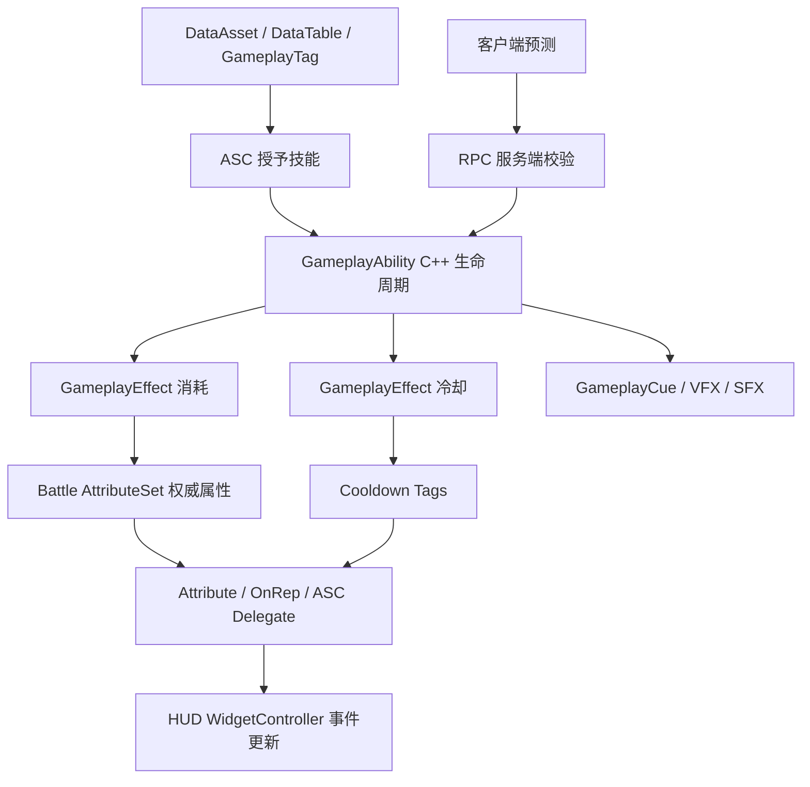

# GAS 系统设计与审查报告

版本：v1.4
日期：2026-07-04
适用范围：`DBA_GameClient/Source/DivineBeastsArena`、`DBA_GameClient/Source/GameMoba` 中与 Gameplay Ability System、战斗属性、技能激活、客户端预测、RPC 校验、竞技场 HUD 同步相关的 C++ 实现。

## 零、v1.4 当前审查结论

本轮复核以当前源码为准，重点检查了 `ADBAPlayerState`、`ADBAZodiacCharacterBase`、`UDBAAbilitySystemComponent`、`UDBABattleAttributeSet`、`UDBAElementAbilityBase` 与 `UDBAAbilitySetDataAsset`。结论是：当前 GAS 主干方向正确，已经具备继续工程化的 C++ 权威基础；当前最需要推进的不是重做 ASC 架构，而是把运行数据、表现资源和同步加载路径继续收敛到 DataAsset、DataTable、DeveloperSettings、本地化表和异步缓存流程。

当前已确认成立的主干约束：

1. `ADBAPlayerState` 持有 `UDBAAbilitySystemComponent`、`UDBABattleAttributeSet` 和 `UDBAHeroGrowthAttributeSet`，Character 作为 AvatarActor 初始化 `AbilityActorInfo`。
2. `UDBAAbilitySystemComponent::GetDBAAvatarCharacter()` 已作为 ASC 内部解析角色上下文的统一入口，主要冷却、目标校验和 GameplayCue 路径不再把 PlayerState Owner 当作 Character。
3. 终极能量、连锁等级、共鸣等级当前由 ASC 权威管理；Character 只保留兼容 Getter、HUD 同步、观战快照和复制镜像职责，不应重新成为权威写源。
4. 普通元素技能已经通过 `CommitAbility`、`CheckCost`、`ApplyCost`、`CheckCooldown`、`ApplyCooldown` 接入 GAS 标准生命周期，支持固定技能组运行配置驱动消耗、冷却 GE、冷却标签和冷却时长。
5. 冷却同步已通过 ASC ActiveGameplayEffect 添加/移除事件驱动，HUD 通过 Attribute Delegate、ASC Delegate、Character 事件镜像更新，符合 UI 事件驱动策略。

当前必须继续收敛的风险：

1. `UDBABattleAttributeSet` 构造函数仍直接初始化生命、攻击、防御、移速、能量、暴击等默认值；这些真实运行数值应迁移到战斗属性初始化 DataAsset 或服务器权威配置，构造函数只保留安全兜底。
2. `ADBAZodiacCharacterBase` 的大厅装配技能 C++ 兜底表已移除，施法规格、技能类、数值和表现资源现在必须来自 `UDBAPlayableSkillComponent` 解析出的技能目录规格；剩余风险是真实 `UDBAPlayableSkillCatalogDataAsset` 资产和默认目录配置尚未在 Editor 中创建、保存并运行验证。
3. `ADBAZodiacCharacterBase::GetMaxEnergy()` 仍返回固定 `100.0f`；后续应由 AttributeSet、角色属性 DataAsset 或服务器配置驱动。
4. `UDBAAbilitySetDataAsset::LoadDataTable()` 当前使用 `LoadSynchronous()`，不符合外部及资源访问异步策略；后续应迁移到 Asset Manager、GameInstance Subsystem 或 GAS 数据缓存的异步预加载流程。
5. 固定技能组源码字段、CSV 和导入脚本已具备，但真实 `DT_FixedSkillGroups.uasset` 字段仍需要在 Editor 中导入、保存和复验，源码契约通过不等同于运行资产闭环完成。
6. Character 中仍存在历史兼容复制字段，后续新增代码只能通过 ASC、Getter、Delegate 或观战 DTO 读取状态，不得直接读写 Character 字段绕过 ASC。

v1.3 后续执行路线：

1. 保持 PlayerState 持 ASC、Character 作为 AvatarActor 的归属策略，继续用契约脚本防止 OwnerActor/AvatarActor 语义回归。
2. 建立或复用战斗属性初始化 DataAsset，迁移 AttributeSet 默认数值与 `GetMaxEnergy()` 一类运行配置。
3. 在 Editor 中创建、导入并配置真实 PlayableSkillCatalog 默认目录资产，补齐大厅技能类、数值、图标、GameplayCue、Niagara、SFX 和文案软引用。
4. 将 AbilitySet DataTable 同步加载迁移为异步预加载和缓存读取，提供完成、失败、降级与中文错误上报。
5. 在 Editor 中完成真实固定技能组 DataTable 导入、保存和 PIE 验证，确认技能栏展示、能量消耗、冷却、战斗公告和事件流均由数据配置驱动。

## 一、审查结论

当前 GAS 系统已经具备 C++ 主导的基础骨架：`ADBAPlayerState` 持有 ASC 和 AttributeSet，`ADBAZodiacCharacterBase` 作为 AvatarActor 初始化 `AbilityActorInfo`；`UDBAAbilitySystemComponent` 负责技能授予、输入激活、终极能量、连锁、共鸣、冷却同步和 GameplayCue 触发；`UDBABattleAttributeSet` 承载生命、普通能量、护盾、攻击、防御等战斗属性；RPC 层已经具备服务端角色上下文、技能输入语义、冷却和终极能量校验；HUD 侧也已经通过 Attribute Delegate 与 ASC 自定义 Delegate 推动主要战斗 UI 更新。

系统当前适合作为多人 MOBA 战斗原型的 C++ 基础，但尚未达到生产级 GAS 闭环。已经完成 ASC 装配固化、终极能量/连锁写源收敛、终极能量重复 Attribute 清理、普通元素技能 `CommitAbility` 消耗提交入口、普通元素技能默认冷却 GE/Tag 提交路径、ASC 冷却镜像事件驱动同步、Character Tick 冷却权威迁移、固定技能组运行配置接入、AbilityBar 展示数据接入、技能释放/连锁就绪/可玩技能兜底展示名中文化，以及大厅装配技能 C++ 兜底表移除。本轮已修复一个 P0 风险：项目已经选择 PlayerState 持有 ASC，`UDBAAbilitySystemComponent` 内部需要角色上下文的路径已经通过 `GetDBAAvatarCharacter()` 优先解析 `AbilityActorInfo->AvatarActor`，输入冷却校验、冷却镜像、目标阵营判定和 GameplayCue Instigator 不再把 PlayerState Owner 当作 Character。后续最需要优先处理的是真实固定技能组资产字段补齐、真实 PlayableSkillCatalog 默认目录资产创建、技能/属性数值继续数据资产化，以及更多 HUD 事件流文案接入 DataAsset 或本地化表。

## 二、现有能力地图

| 能力域 | 当前实现 | 主要文件 |
| --- | --- | --- |
| ASC 基础 | 技能组授予、按输入 ID 激活、终极能量、连锁、共鸣、冷却同步、GameplayCue 广播 | `DBAAbilitySystemComponent.h/.cpp` |
| AttributeSet | 生命、普通能量、护盾、攻击、防御、移速、暴击复制与钳制；终极能量已从此处移除 | `DBABattleAttributeSet.h/.cpp` |
| 技能基类 | 元素技能、生肖技能、生肖大招、被动、共鸣的 C++ 基类与扩展点 | `GameDBA/GAS/Abilities/*` |
| 数据入口 | 固定技能组行、AbilitySet DataAsset、技能表软引用、生肖/元素身份校验 | `GameDBA/Data/*AbilitySet*`、`DBAFixedSkillGroupData.h` |
| RPC 权威 | 技能激活、终极技能、输入语义、冷却、目标与角色上下文校验 | `DBARpcHandler.cpp` |
| 客户端预测 | 本地预测入口、技能 ID 到输入 ID 的桥接、RPC 提交 | `DBAClientPredictionComponent.cpp` |
| HUD 同步 | Attribute Delegate、ASC 自定义 Delegate、HUD Controller 和 UI Manager 更新 | `DBAZodiacCharacterBase.cpp`、`GameDBA/UI/Arena/*` |
| 契约脚本 | C++ 生命周期、权威边界、输入语义、冷却、HUD Delegate 等脚本化检查 | `scripts/test-*gas*`、`scripts/test-*ability*`、`scripts/test-*hud*` |

## 三、主要发现

### P0：ASC 装配与归属路径已固化，后续需继续保护初始化契约

证据：

- `ADBAPlayerState` 已实现 `IAbilitySystemInterface`，并在构造函数中创建 `UDBAAbilitySystemComponent`、`UDBABattleAttributeSet` 和 `UDBAHeroGrowthAttributeSet` 子对象，见 `DBA_GameClient/Source/DivineBeastsArena/Private/GameDBA/Player/DBAPlayerState.cpp:22` 到 `DBA_GameClient/Source/DivineBeastsArena/Private/GameDBA/Player/DBAPlayerState.cpp:27`。
- `ADBAZodiacCharacterBase::GetDBAAbilitySystemComponent()` 已优先从 `ADBAPlayerState` 获取强类型 ASC，角色作为 AvatarActor 消费 PlayerState ASC，见 `DBA_GameClient/Source/DivineBeastsArena/Private/GameDBA/Character/DBAZodiacCharacterBase.cpp:1288`。
- 角色属性读取、HUD 同步、RPC、预测和 VFX 仍高度依赖该 ASC 初始化路径稳定非空。
- `scripts/test-gas-playerstate-asc-ownership-contract.ps1` 已保护 PlayerState ASC 归属、AttributeSet 子对象创建和角色 `AbilityActorInfo` 初始化契约。

影响：

ASC 装配路径的首要风险已经消除。剩余风险集中在后续新增 Pawn、观战 Pawn、重连流程或训练场测试角色时绕过 `ADBAPlayerState` 归属约定，导致技能激活、属性读取、HUD 同步和终极能量判断在边缘流程退化为空 ASC。

建议：

1. 保持项目级 ASC 归属策略：PlayerState 作为 OwnerActor 持有 ASC 与 AttributeSet，Character 作为 AvatarActor。
2. 新增可控 Pawn、AI 代理、训练场角色或观战实体时，必须复用同一套 `InitAbilityActorInfo` 初始化路径，并输出中文错误日志。
3. 持续保留自动化契约：检查 `DBAAbilitySystemComponent` 的装配点、`InitAbilityActorInfo` 调用点、`UDBABattleAttributeSet` 与 `UDBAHeroGrowthAttributeSet` 可获取性。

### 历史 P0：ASC 内部 OwnerActor 与 AvatarActor 语义混用（已修复）

证据：

- `ADBAPlayerState` 在构造函数中创建 `UDBAAbilitySystemComponent`，因此 ASC 的组件 Owner 是 PlayerState，见 `DBA_GameClient/Source/DivineBeastsArena/Private/GameDBA/Player/DBAPlayerState.cpp:22` 到 `DBA_GameClient/Source/DivineBeastsArena/Private/GameDBA/Player/DBAPlayerState.cpp:27`。
- `ADBAZodiacCharacterBase::InitializeDBAAbilityActorInfo()` 调用 `DBAAbilitySystem->InitializeAbilities(DBAPlayerState, this)`，明确把 PlayerState 作为 OwnerActor、Character 作为 AvatarActor，见 `DBA_GameClient/Source/DivineBeastsArena/Private/GameDBA/Character/DBAZodiacCharacterBase.cpp:489` 到 `DBA_GameClient/Source/DivineBeastsArena/Private/GameDBA/Character/DBAZodiacCharacterBase.cpp:508`。
- `UDBAMobaAbilitySystemComponentBase::InitializeAbilities()` 仅调用 `InitAbilityActorInfo(InOwnerActor, InAvatarActor)`，不会改变组件 Owner，见 `DBA_GameClient/Source/GameMoba/Private/GameMoba/GAS/DBAMobaAbilitySystemComponentBase.cpp:27` 到 `DBA_GameClient/Source/GameMoba/Private/GameMoba/GAS/DBAMobaAbilitySystemComponentBase.cpp:35`。
- `UDBAAbilitySystemComponent::IsInputAbilityOnCooldown()` 使用 `Cast<ADBAZodiacCharacterBase>(GetOwner())` 解析角色，见 `DBA_GameClient/Source/DivineBeastsArena/Private/GameDBA/GAS/DBAAbilitySystemComponent.cpp:460` 到 `DBA_GameClient/Source/DivineBeastsArena/Private/GameDBA/GAS/DBAAbilitySystemComponent.cpp:475`。在 PlayerState 持 ASC 的架构下，这里会得到空 Character，从而让输入冷却权威门禁退化为 `false`。
- `UDBAAbilitySystemComponent::SyncCooldownsToCharacter()` 同样使用 `Cast<ADBAZodiacCharacterBase>(GetOwner())`，见 `DBA_GameClient/Source/DivineBeastsArena/Private/GameDBA/GAS/DBAAbilitySystemComponent.cpp:677` 到 `DBA_GameClient/Source/DivineBeastsArena/Private/GameDBA/GAS/DBAAbilitySystemComponent.cpp:691`。这会让 ASC 监听到冷却 GE 增删后无法把冷却镜像推回 Character，影响 HUD 与观战冷却显示。
- `TryActivateAbilityByInputID()`、`IsValidTarget()` 和 `TriggerGameplayCue()` 还分别把 `GetOwner()` 用作技能提示目标兜底、阵营判定源和 GameplayCue Instigator，见 `DBAAbilitySystemComponent.cpp:450`、`DBAAbilitySystemComponent.cpp:545`、`DBAAbilitySystemComponent.cpp:565`。这些路径在 PlayerState Owner 下都应优先使用 AvatarActor。

影响：

这是历史 GAS 运行闭环里优先级最高的源码风险。该问题已通过 `GetDBAAvatarCharacter()` 统一 AvatarActor 解析路径修复，并由 `scripts/test-ability-system-avatar-actor-context-contract.ps1` 等契约脚本保护。保留本节用于说明问题来源和后续禁止回归的原因。

建议：

1. 在 `UDBAAbilitySystemComponent` 内新增一个只读辅助函数，例如 `GetDBAAvatarCharacter()`，优先从 `AbilityActorInfo->AvatarActor` 或 `GetAvatarActor()` 解析 `ADBAZodiacCharacterBase`，只在兼容旧测试角色时才回退组件 Owner。
2. 将 `IsInputAbilityOnCooldown()`、`SyncCooldownsToCharacter()`、`IsValidTarget()`、`TriggerGameplayCue()` 和技能提示目标兜底统一改为使用 AvatarActor 语义。
3. 新增契约脚本禁止在这些运行路径中继续 `Cast<ADBAZodiacCharacterBase>(GetOwner())`，并要求冷却门禁与冷却镜像函数显式解析 AvatarActor。
4. 修复后执行 `test-ability-system-input-cooldown-authority-gate.ps1`、`test-ability-system-cooldown-event-driven-sync.ps1`、`test-arena-ability-bar-cooldown-event-sync.ps1`、`test-rpc-handler-ability-cooldown-validation.ps1` 和 Editor 目标编译。

当前落实记录（2026-07-04 追加修复）：

- `UDBAAbilitySystemComponent` 已新增 `GetDBAAvatarCharacter()`，优先从 `AbilityActorInfo->AvatarActor` 解析 `ADBAZodiacCharacterBase`。
- `IsInputAbilityOnCooldown()` 已改为通过 `GetDBAAvatarCharacter()` 获取角色冷却缓存，不再把 PlayerState Owner 当作 Character。
- `SyncCooldownsToCharacter()` 已改为通过 AvatarActor 推送 ASC 冷却镜像，冷却 GE 添加/移除事件可以正确回写 Character 复制缓存和 HUD/观战事件。
- `IsValidTarget()` 已改为使用 AvatarActor 作为技能来源角色进行阵营判定，避免 PlayerState 被错误用于 TeamId 解析。
- `TriggerGameplayCue()` 已优先使用 AvatarActor 作为 GameplayCue Instigator；技能激活反馈目标兜底也改为 AvatarActor。
- 已新增 `scripts/test-ability-system-avatar-actor-context-contract.ps1`，并更新 `scripts/test-ability-system-input-cooldown-authority-gate.ps1`、`scripts/validate-production-evidence-contracts.ps1`、`scripts/test-production-evidence-automation.ps1`，防止该问题回归。

### P0：战斗状态存在多份权威源

证据：

- `UDBAAbilitySystemComponent` 自身复制 `UltimateEnergy`、`ChainLevel`、`ResonanceLevel`，见 `DBAAbilitySystemComponent.cpp:653` 到 `DBAAbilitySystemComponent.cpp:655`。
- 初始审查时 `UDBABattleAttributeSet` 同时包含并复制 `UltimateEnergy`；阶段 2 已移除该重复 GameplayAttribute，终极能量权威源固定为 ASC。
- 初始审查时 `ADBAZodiacCharacterBase` 也维护 `UltimateEnergy`、`ChainLevel`、`ResonanceLevel`，并在桥接函数中直接写角色字段；该 Character 写源已在阶段 2 中收敛为 ASC 委托，详见下文“阶段 2：统一状态源”落实记录。
- RPC 终极技能校验通过 `CharacterRef->GetUltimateEnergy()` 判断满能量，见 `DBARpcHandler.cpp:348`，而大招基类扣除的是 ASC 内的终极能量，见 `DBAZodiacUltimateAbilityBase.cpp:56`。

影响：

终极能量、连锁、共鸣如果同时存在 ASC 字段、AttributeSet 字段和 Character 镜像字段，容易出现 RPC 校验、HUD 显示、技能扣费和观战数据不一致。阶段 2 已先移除 Character 对这些状态的权威写入；剩余重点是处理 ASC 与 AttributeSet 的终极能量重复字段，避免网络复制、死亡重生、换 Pawn、断线重连和观战切换时发生状态漂移。

建议：

1. 保持当前权威分工：生命、普通能量、护盾等资源属性走 `UDBABattleAttributeSet`；终极能量、连锁、共鸣暂由 `UDBAAbilitySystemComponent` 权威管理。
2. 后续如需把终极能量迁移为 GameplayAttribute，必须一次性迁移 ASC、RPC、大招、HUD、观战快照和契约脚本，不允许重新出现双写源。
3. Character 字段只保留兼容读取或观战快照，不再作为权威写入源。
4. RPC、技能基类、HUD、观战数据全部读取同一个权威源。

### P1：普通技能消耗与默认冷却 GE/Tag 已接入 GAS 提交点

证据：

- `UDBAElementSkillAbility_Generic::ActivateAbility` 已在触发 GameplayCue 和扩展点之前调用 `CommitAbility(Handle, ActorInfo, ActivationInfo)`；提交失败时输出中文日志并取消 Ability。
- `UDBAElementAbilityBase` 已同时覆盖 `CheckCost` 与 `ApplyCost`：`CommitAbility` 主路径先检查 `CurrentEnergy`，再在服务端权威路径按 `FMath::Max(AbilityEnergyCost, EnergyCost)` 扣减 `UDBABattleAttributeSet::CurrentEnergy`，扣减后执行钳制；`CommitAbilityCost` 保留为父类流程桥接，避免绕过 UE 标准提交链。
- 已新增 `scripts/test-element-ability-commit-cost-cooldown-contract.ps1`，保护普通元素技能必须通过 `CommitAbility` 提交消耗/冷却，并保护 C++ 权威扣能量路径。
- `UDBAElementAbilityBase` 已重写 `CheckCooldown`、`ApplyCooldown`、`GetCooldownTimeRemainingAndDuration`，当 Ability 未配置专用 Cooldown GE 时，会使用 `UDBAGE_Cooldown`、`CooldownDuration` 和输入槽对应的 `Cooldown.Skill01~Skill04/Ultimate` 原生标签创建动态冷却 GE。
- `UDBAAbilitySystemComponent::GetSkillCooldowns` 已改为通过 `GetCooldownTimeRemainingAndDuration(Spec->Handle, AbilityActorInfo.Get(), ...)` 查询冷却，避免同一个泛型 Ability Class 授予多个输入槽时冷却串槽。
- 已新增 `scripts/test-element-ability-cooldown-ge-tag-contract.ps1`，保护普通元素技能必须使用项目冷却 GE、动态时长、动态授予冷却标签和带 SpecHandle 的 ASC 冷却查询。

影响：

普通技能“能量检查通过但未扣费”和“未配置 Cooldown GE 时无法生成 GAS 冷却”的首要风险已消除。ASC 层冷却镜像已由 ActiveGameplayEffect 增删事件驱动，不再依赖 `CooldownSyncTimerHandle` 定时轮询；Character Tick 也不再递减本地 `SkillCooldowns` 镜像，角色侧只通过 `UpdateSkillCooldowns` 和 `OnRep_SkillCooldowns` 广播 ASC 冷却镜像。固定技能组 DataAsset 已新增普通技能运行配置入口和中文校验日志，覆盖 `EnergyCost`、`CostGameplayEffectClass`、`CooldownDuration`、`CooldownGameplayEffectClass`、`CooldownTag`、UI 显示名与图标；ASC 已按 GAS InputID 缓存这些配置，元素 Ability 在消耗、冷却 GE、冷却时长与冷却标签解析时优先读取 DataAsset 配置。AbilityBar 已通过 C++ 从 ASC 运行配置覆盖技能显示名、图标软引用与冷却总时长，并通过异步资源加载回填技能图标。剩余风险集中在真实资产数据补齐和更完整的 HUD 文案闭环：现有 `.uasset` 固定技能组需要填充配置字段，事件流、战斗提示和更多 HUD 区域仍需继续消费 DataAsset/本地化文案。

建议：

1. 保持普通技能激活入口必须调用 `CommitAbility`，不得绕过 C++ 技能生命周期。
2. 将普通技能消耗从当前直接扣 `CurrentEnergy` 的权威实现进一步数据化为 Cost GameplayEffect 或明确的消耗 DataAsset 配置。
3. 保持默认冷却路径使用 GameplayEffect + Cooldown Tag，并继续推进 ASC 冷却开始/结束事件；Character 只接收 ASC 事件镜像，不自行倒计时。
4. 每个技能 DataAsset/DataTable 声明消耗、冷却、标签、提示文案和表现资源，C++ 只读取、校验和应用。

### P1：冷却同步已迁移为 ASC 事件驱动，剩余数据闭环待收敛

证据：

- `ADBAZodiacCharacterBase::Tick` 已移除服务端逐帧递减 `SkillCooldowns` 和维护 `SkillMaxCooldowns` 默认冷却的逻辑。
- `UDBAAbilitySystemComponent::BeginPlay` 已绑定 `OnActiveGameplayEffectAddedDelegateToSelf` 与 `OnAnyGameplayEffectRemovedDelegate()`，冷却 GE 添加、移除或自然结束时调用 `SyncCooldownsToCharacter`。
- `SyncCooldownsToCharacter` 会广播 `OnSkillCooldownUpdated` 与 `OnAllSkillCooldownsUpdated`，HUD 与观战层可消费该事件镜像。
- `ADBAZodiacCharacterBase::UpdateSkillCooldowns` 仍作为服务端权威镜像入口接收 ASC 冷却数组并广播 `OnSkillCooldownsChanged`，`OnRep_SkillCooldowns` 在客户端复制到达后继续广播 HUD 事件。
- 已新增 `scripts/test-zodiac-character-cooldown-event-mirror-contract.ps1`，保护 Character Tick 不得重新遍历或递减 `SkillCooldowns`，并保护 `UpdateSkillCooldowns` / `OnRep_SkillCooldowns` 的事件镜像职责。

影响：

项目全局策略要求 UI 使用事件更新，不依赖 Tick 轮询；当前 ASC 层和 Character 镜像层都已收敛到事件驱动路径。AbilitySet/DataAsset 已具备 Cooldown GE、Cooldown Tag、Cooldown Duration、UI 显示文案和图标的第一层配置校验；后续风险是这些配置尚未成为 GAS 授予与激活路径的唯一数据源。

建议：

1. 保持 GAS Cooldown Tag/GE 变更事件驱动，ASC 在技能激活、冷却开始、冷却结束时主动广播。
2. HUD 只消费冷却事件和 Attribute Delegate，不直接从 Tick 拉取状态。
3. 保持固定技能组运行配置接入 GAS 执行路径；AbilityBar 已消费 DisplayName/Icon/Cooldown，后续继续把事件流、战斗提示和更完整的 HUD 文案接入 DataAsset/本地化表，并输出中文诊断日志。

### P1：运行数值仍存在硬编码入口

证据：

- `UDBABattleAttributeSet` 构造函数直接初始化生命、攻击、防御、移速等默认数值，见 `DBABattleAttributeSet.cpp:19` 到 `DBABattleAttributeSet.cpp:31`。
- 固定技能组数据结构已经具备技能 ID、输入键、共鸣、AbilitySet、图标和文案配置入口，见 `DBAFixedSkillGroupData.h` 中 `ElementSkill1Id`、`ZodiacUltimateSkillId`、`AbilitySetAsset`、`DisplayName` 等字段。
- `DBAConstants` 中仍承载大量连锁、共鸣、终极能量阈值和恢复量。部分属于技术边界常量可以保留，但技能、角色、成长、平衡数值应优先迁移到 DataAsset/DataTable。

影响：

硬编码数值会阻碍策划调参、版本热更新、运营配置和自动化数据校验，也与“项目所有代码不写硬编码，使用数据资产”的全局策略不完全一致。

建议：

1. 为角色基础属性建立 `UDBACombatAttributeInitDataAsset` 或复用现有 Hero/AbilitySet 数据资产。
2. AttributeSet 构造函数只保留安全兜底值，真实运行值由服务器权威初始化流程写入。
3. 增加数据校验：缺字段、非法范围、软引用失效、版本不兼容全部输出中文错误日志。

### P1：UI 战斗提示英文文案已收敛到中文展示数据路径

证据：

- `HandleArenaHUDSkillCueExecuted` 已使用 `{0} 已释放` 中文本地化文本，并通过 `ResolveArenaHUDSkillCueDisplayName` 优先读取 ASC 固定技能组运行配置中的 `DisplayName`，不再把内部 `SkillId` 暴露给 HUD。
- `SyncArenaHUDFromAttributes` 的连锁就绪播报已使用 `连锁就绪` 中文本地化文本，不再使用 `Chain Ready` 英文占位。
- `scripts/test-zodiac-character-gas-skill-feedback-hud-announcement.ps1` 已保护技能释放提示必须使用固定技能组运行配置展示名、中文本地化文本，并禁止 `FText::FromString(SkillId.ToString())`。
- `scripts/test-zodiac-character-arena-hud-chain-announcement.ps1` 已保护连锁就绪战斗提示必须使用中文文本，并禁止 `Chain Ready` 回归。

影响：

战斗提示的当前 C++ 事件入口已符合“中文输出、事件驱动、DataAsset 展示数据优先”的全局策略；剩余风险不在基础桥接，而在真实固定技能组资产字段、更多事件流文案和本地化表继续补齐。

建议：

1. 保持技能展示名来自 DataAsset 或本地化表，不直接显示内部 `SkillId`。
2. 继续补齐事件流、击杀/助攻/目标状态等 HUD 文案的数据资产化和本地化表入口。
3. 对新增 HUD、事件流、调试提示持续增加中文输出契约脚本。

### P2：数据资产体系已经成形，但运行时闭环还需要进一步收敛

证据：

- `FDBAZodiacElementFixedSkillGroupRow` 已定义固定技能组身份、输入键、技能 ID、AbilitySet 软引用、显示文案和身份校验。
- `UDBAAbilitySetDataAsset` 已提供元素被动、主动技能、大招模板、共鸣、生肖大招、技能数据表等软引用入口。
- `UDBAAbilitySystemComponent::GrantAbilitiesFromFixedSkillGroup` 已能通过固定技能组 ID 授予技能，见 `DBAAbilitySystemComponent.cpp:113`。

影响：

这是正确方向，但需要进一步保证“固定技能组 DataTable -> AbilitySet DataAsset -> GameplayAbility Class/GE/Tag -> ASC 授予”的链路唯一、可验证、可回放。

建议：

1. 固定技能组行只描述生肖、元素、技能 ID、输入与资源引用，不写运行逻辑。
2. AbilitySet DataAsset 明确每个技能对应的 Ability Class、Cost GE、Cooldown GE、GameplayCue、UI 图标、VFX/SFX 引用。
3. ASC 授予技能时输出中文审计日志：技能组 ID、技能槽、AbilityClass、输入 ID、Cost/Cooldown 数据源。

## 四、推荐目标架构



推荐权威分工：

| 状态 | 推荐权威源 | 说明 |
| --- | --- | --- |
| CurrentHealth / MaxHealth | `UDBABattleAttributeSet` | 通过 GE 修改，Attribute Delegate 驱动 UI |
| CurrentEnergy / MaxEnergy | `UDBABattleAttributeSet` | 当前普通元素技能已在 `CommitAbilityCost` 中服务端权威扣减；目标形态是通过 Cost GE/DataAsset 驱动 |
| UltimateEnergy | `UDBAAbilitySystemComponent` | 当前已选择 ASC 作为权威源；BattleAttributeSet 和 Character 不再写入重复终极能量 |
| ChainLevel | ASC 或 CombatStateComponent | 由命中事件驱动，不由 UI 或 Character Tick 写入 |
| ResonanceLevel | ASC 或 CombatStateComponent | 从固定技能组/元素组合派生，运行时只读或事件更新 |
| SkillCooldowns | GAS Cooldown GE/Tag | HUD 消费事件镜像，不自行倒计时 |
| 技能配置 | AbilitySet DataAsset/DataTable | C++ 读取、校验、应用，Blueprint 只配置表现资源 |

## 五、分阶段整改路线

### 阶段 1：固化 ASC 与 AttributeSet 装配

目标：

- 明确 ASC 挂载在 PlayerState 还是 Character。
- 在 C++ 中创建 ASC 与 AttributeSet，统一初始化 `InitAbilityActorInfo`。
- 增加中文日志和自动化契约，保证 Dedicated Server 与客户端路径都能拿到 ASC。

当前落实记录（2026-07-04）：

- 已确定 `ADBAPlayerState` 作为 ASC OwnerActor，`ADBAZodiacCharacterBase` 作为 AvatarActor。
- `ADBAPlayerState` 已实现 `IAbilitySystemInterface`，并创建 `UDBAAbilitySystemComponent`、`UDBABattleAttributeSet`、`UDBAHeroGrowthAttributeSet` 子对象。
- `ADBAZodiacCharacterBase` 已在 `PossessedBy` 与 `OnRep_PlayerState` 中统一调用 `InitializeDBAAbilityActorInfo`，并优先从 `ADBAPlayerState` 获取强类型 ASC。
- 已新增 `scripts/test-gas-playerstate-asc-ownership-contract.ps1`，用于保护 PlayerState ASC 归属与角色 Avatar 初始化契约。

验收：

- 角色进入对局后 `GetDBAAbilitySystemComponent()` 稳定非空。
- `UDBABattleAttributeSet` 能通过 `ASC->GetSet<UDBABattleAttributeSet>()` 获取。
- 技能授予、RPC 技能激活、HUD 属性同步均使用同一个 ASC。

### 阶段 2：统一状态源

目标：

- 终极能量只保留一个权威源。
- 连锁、共鸣只保留一个权威源。
- Character 字段降级为只读镜像或删除兼容层。

当前落实记录（2026-07-04）：

- `ADBAZodiacCharacterBase::SetUltimateEnergy`、`AddUltimateEnergy`、`AddChainLevel`、`ResetChainLevel` 已不再直接写 `UltimateEnergy` / `ChainLevel` 复制字段，统一委托 `UDBAAbilitySystemComponent` 执行权威写入。
- `ADBAZodiacCharacterBase::IsUltimateReady` 与观战快照中的终极能量读取已改为通过角色 getter 读取，优先走 ASC 状态。
- 已新增 `scripts/test-zodiac-character-gas-state-single-source.ps1`，保护角色桥接函数不得重新写入 Character 本地战斗状态。
- 已更新 `scripts/test-zodiac-character-fallback-state-authority-boundary.ps1` 与 `scripts/test-zodiac-character-ultimate-energy-constants.ps1`，使旧契约与 ASC 单源策略一致。
- `UDBABattleAttributeSet` 中重复的 `UltimateEnergy` GameplayAttribute 已移除，终极能量的复制、扣费、恢复、HUD 事件和 RPC 校验均以 `UDBAAbilitySystemComponent` 为权威源。
- 已新增 `scripts/test-battle-attribute-set-no-ultimate-energy-duplicate.ps1`，保护 BattleAttributeSet 不再重新定义、复制或钳制重复终极能量字段。

验收：

- RPC 终极能量校验、大招消耗、HUD 显示、观战数据读取同一个源。
- 断线重连、换 Pawn、死亡复活后状态不漂移。

### 阶段 3：收敛普通技能消耗和冷却

目标：

- 所有普通技能通过 `CommitAbility` 提交消耗。
- 冷却统一使用 GE/Tag 或 ASC 事件。
- 移除 Character Tick 冷却权威。

当前落实记录（2026-07-04）：

- `UDBAElementSkillAbility_Generic::ActivateAbility` 已在执行日志、GameplayCue 和 C++ 扩展点前调用 `CommitAbility`，提交失败时输出中文日志并取消 Ability。
- `UDBAElementAbilityBase::CheckCost` 已按 `AbilityEnergyCost` 与 `EnergyCost` 中较大值检查 `CurrentEnergy`，`ApplyCost` 仅在服务端权威路径写入 `UDBABattleAttributeSet` 扣减能量；`CommitAbilityCost` 保留父类提交桥接，避免双扣。
- 已新增 `scripts/test-element-ability-commit-cost-cooldown-contract.ps1`，保护普通元素技能消耗/冷却提交点、权威扣能量和中文诊断日志。
- `UDBAElementAbilityBase` 已建立默认冷却路径：优先保留专用 `CooldownGameplayEffectClass`，未配置时使用 `UDBAGE_Cooldown`、`CooldownDuration` 与 `CooldownTag` 或输入槽原生标签生成动态冷却 GE。
- `UDBAAbilitySystemComponent::GetSkillCooldowns` 已改为带 `SpecHandle` 查询冷却，保证同一个泛型 Ability Class 的不同输入槽可以读取各自冷却标签。
- 已新增 `scripts/test-element-ability-cooldown-ge-tag-contract.ps1`，保护普通元素技能冷却 GE/Tag、动态时长、动态授予标签和 ASC 带 Handle 查询路径。
- `UDBAAbilitySystemComponent` 已绑定 ActiveGameplayEffect 添加与移除事件，冷却 GE 开始、结束或被移除时会调用 `SyncCooldownsToCharacter`；ASC 层不再使用 `CooldownSyncTimerHandle` 定时轮询冷却。
- 已新增 `scripts/test-ability-system-cooldown-event-driven-sync.ps1`，保护 ASC 冷却同步必须由 ActiveGameplayEffect 增删事件驱动，并禁止重新引入 ASC 冷却同步轮询定时器。
- `ADBAZodiacCharacterBase::Tick` 已移除本地 `SkillCooldowns` 逐帧递减与默认冷却维护逻辑；Character 侧冷却状态只作为 ASC 事件镜像和复制镜像被 HUD 消费。
- 已新增 `scripts/test-zodiac-character-cooldown-event-mirror-contract.ps1`，保护 Character Tick 不得重新引入冷却倒计时权威，并保护 `UpdateSkillCooldowns` / `OnRep_SkillCooldowns` 的事件广播职责。
- `UDBAFixedSkillGroupDataAsset` 已新增 `FDBAAbilityRuntimeConfig`，为 Skill01~Skill04 提供 `EnergyCost`、`CostGameplayEffectClass`、`CooldownDuration`、`CooldownGameplayEffectClass`、`CooldownTag`、`DisplayName` 与 `Icon` 配置入口。
- `UDBAFixedSkillGroupDataAsset::ValidateRuntimeAbilityConfigs` 已在固定技能组同步和异步加载路径输出中文校验日志；运行时兜底技能组会填充兜底显示名、冷却时长和冷却标签，避免 fallback 自身制造配置缺失噪声。
- 已新增 `scripts/test-fixed-skill-group-ability-runtime-config-contract.ps1`，保护固定技能组运行配置结构、四个普通技能槽配置、中文校验函数和加载路径校验日志。
- `UDBAAbilitySystemComponent` 已在授予固定技能组时按 InputID 缓存 Skill01~Skill04 的 `FDBAAbilityRuntimeConfig`，并提供 C++ 查找入口供 Ability 使用。
- `UDBAElementAbilityBase` 已通过 ASC 缓存解析运行配置，普通技能能量消耗、Cost GE、Cooldown GE、Cooldown Duration 与 Cooldown Tag 均优先使用固定技能组 DataAsset 配置，未配置时保留 Ability 字段和项目默认 `UDBAGE_Cooldown` 兜底。
- 已新增 `scripts/test-fixed-skill-group-runtime-config-gas-application-contract.ps1`，保护固定技能组运行配置必须接入 ASC 缓存和元素 Ability 执行路径。
- `FDBAPlayableSkillRuntimeSpec` 已新增技能图标软引用；`UDBAAbilityBarWidgetBase` 会按技能槽映射 GAS InputID，从 `UDBAAbilitySystemComponent` 读取固定技能组运行配置，覆盖 DisplayName、Icon 与 Cooldown；图标通过 `DBAAsyncAssetLoader::RequestAsyncAsset<UTexture2D>` 异步加载并回填技能槽 Widget，避免 UI 同步阻塞加载。
- 已新增 `scripts/test-ability-bar-runtime-config-display-data-contract.ps1`，保护 AbilityBar 必须使用固定技能组运行配置展示数据、必须异步加载图标，并禁止在 AbilityBar 中引入 `LoadSynchronous`。
- 阶段 3 的 C++ 执行路径已经贯通；剩余内容转入阶段 4：固定技能组真实资产字段、击杀/助攻/目标状态/异常提示等更完整 HUD 文案、技能文案本地化和更多技能数值仍需要继续数据资产化。

验收：

- 能量不足时技能无法激活并输出中文原因。
- 技能激活后能量扣减、冷却开始、HUD 更新和 GameplayCue 触发顺序稳定。
- 冷却结束由事件驱动 UI 更新。

### 阶段 4：数据资产化和中文化

目标：

- 将角色基础属性、技能数值、冷却、消耗、文案、图标、VFX/SFX 引用迁移到 DataAsset/DataTable。
- 英文战斗提示替换为中文本地化文案。

当前落实记录（2026-07-04）：

- `scripts/write-fixed-skill-group-source-csv.ps1` 已将 `DT_FixedSkillGroups.csv` 的 `DisplayName`、`Description`、`DesignerNotes` 生成规则改为中文文本，避免后续从源 CSV 导入真实 DataTable 时继续携带 `Fixed Skill Group`、`MVP canonical fixed skill group generated from Zodiac + Element.` 等英文模板。
- `DBA_GameClient/Content/DBA/Data/Tables/Source/DT_FixedSkillGroups.csv` 已重写为 60 行中文展示源数据，例如 `Rat_Water` 的展示名为 `鼠水固定技能组`，描述为 `MVP 阶段由生肖与自然元素之力生成的标准固定技能组。`，备注为 `自动生成的 MVP 源表行；后续通过策划评审后的 DataTable 更新补齐数值与资源。`。
- `scripts/write-fixed-skill-group-source-csv.ps1` 的源 CSV 校验失败信息已中文化，包括行数不正确、缺少表头、行身份不匹配、不支持的生肖/自然元素、共鸣元素不匹配、重复行、缺少必需行和源 CSV 缺失等路径。
- `scripts/test-fixed-skill-group-source-csv.ps1` 已新增中文展示数据和中文校验诊断契约，保护固定技能组源 CSV 不再回退到英文 UI/DataTable 模板或英文校验错误。
- `scripts/import-fixed-skill-group-datatable.ps1` 与 `scripts/unreal/import_fixed_skill_group_datatable.py` 的人类可见失败信息和导入完成日志已中文化，包括项目文件缺失、源 CSV 缺失、行结构缺失、资产越界写入、导入行数不匹配和保存失败等路径。
- `scripts/test-fixed-skill-group-datatable-import.ps1` 已新增导入工具中文诊断契约，保护固定技能组 DataTable 导入链路不再回退到英文错误输出。
- `scripts/diagnose-fixed-skill-group-datatable.ps1` 的只读诊断输出已中文化，包括非 `/Game` 包路径、项目文件缺失、Editor 命令缺失、目标资产缺失、自动化验证失败和验证完成等路径。
- `scripts/test-fixed-skill-group-datatable-diagnostic.ps1` 已新增只读诊断中文输出契约，保护固定技能组 DataTable 诊断链路不再回退到英文错误输出。
- `UDBAPlayableSkillComponent` 已移除 `ResetToDefaultSkillSpecs()` 中的 C++ 内置技能表，默认技能目录改为组件级 `DefaultSkillCatalog` 或项目级 `UDBAPlayableSkillDeveloperSettings::DefaultSkillCatalog` 软引用，并通过 `DBAAsyncAssetLoader::RequestAsyncAsset<UDBAPlayableSkillCatalogDataAsset>` 异步加载。
- `ADBAZodiacCharacterBase` 已移除大厅装配技能 C++ 兜底表、硬编码技能 ID、硬编码 `/Game/...` Niagara/SFX 资源路径、角色级火球数值覆盖和默认技能类兜底；`CastEquippedSkillInternal()` 现在必须从 `FDBAPlayableSkillRuntimeSpec` 读取技能类、数值、冷却和表现资源，缺少数据资产配置类时输出中文日志并停止。
- `ResolveEquippedLobbySkillId()` 已改为优先从 `UDBAPlayableSkillComponent` 解析数据资产技能 ID，再用固定技能组覆盖；当技能目录与固定技能组都未配置时返回空技能 ID，不再制造隐藏 C++ 默认技能。
- 已新增 `scripts/test-playable-skill-catalog-defaults-data-asset-contract.ps1` 与 `scripts/test-zodiac-character-lobby-skill-data-asset-boundary.ps1`，并接入生产证据总入口，防止可玩技能目录或角色大厅技能路径回退到 C++ 硬编码。

验收：

- 新增或修改技能不需要改 C++ 数值。
- 缺失配置、非法数值、失效软引用全部输出中文错误。
- HUD 事件流和战斗提示不显示内部技能 ID 或英文占位文案。

## 六、已执行验证

本次审查执行了以下现有契约脚本，均通过：

```powershell
.\scripts\test-gas-ability-cpp-lifecycle-boundary.ps1
.\scripts\test-ability-system-state-authority-boundary.ps1
.\scripts\test-rpc-ability-input-semantic-boundary.ps1
.\scripts\test-rpc-handler-ability-cooldown-validation.ps1
.\scripts\test-ability-system-input-cooldown-authority-gate.ps1
.\scripts\test-zodiac-character-gas-input-activation-bridge.ps1
.\scripts\test-zodiac-character-arena-hud-attribute-delegates.ps1
.\scripts\test-arena-ability-bar-cooldown-event-sync.ps1
```

阶段 1 落实后追加执行了以下验证，均通过：

```powershell
.\scripts\test-gas-playerstate-asc-ownership-contract.ps1
.\scripts\test-gas-ability-cpp-lifecycle-boundary.ps1
.\scripts\test-ability-system-state-authority-boundary.ps1
.\scripts\test-ability-system-input-cooldown-authority-gate.ps1
.\scripts\test-zodiac-character-gas-input-activation-bridge.ps1
.\scripts\test-rpc-ability-input-semantic-boundary.ps1
.\scripts\test-rpc-handler-ability-cooldown-validation.ps1
.\scripts\test-zodiac-character-arena-hud-attribute-delegates.ps1
.\scripts\test-arena-ability-bar-cooldown-event-sync.ps1
& 'D:\UnrealEngine-5.8.0-release\Engine\Build\BatchFiles\Build.bat' DivineBeastsArenaEditor Win64 Development -Project='E:\work\Game\DivineBeastsArena\DBA_GameClient\DivineBeastsArena.uproject' -WaitMutex -NoHotReloadFromIDE
```

阶段 2 角色写源收敛后追加执行了以下验证，均通过：

```powershell
.\scripts\test-zodiac-character-gas-state-single-source.ps1
.\scripts\test-zodiac-character-fallback-state-authority-boundary.ps1
.\scripts\test-zodiac-character-ultimate-energy-constants.ps1
.\scripts\test-ability-system-state-authority-boundary.ps1
.\scripts\test-zodiac-character-gas-input-activation-bridge.ps1
.\scripts\test-rpc-ability-input-semantic-boundary.ps1
.\scripts\test-rpc-handler-ability-cooldown-validation.ps1
.\scripts\test-zodiac-character-arena-hud-attribute-delegates.ps1
.\scripts\test-arena-ability-bar-cooldown-event-sync.ps1
.\scripts\test-arena-hud-ultimate-energy-sync.ps1
.\scripts\test-arena-hud-chain-resonance-sync.ps1
& 'D:\UnrealEngine-5.8.0-release\Engine\Build\BatchFiles\Build.bat' DivineBeastsArenaEditor Win64 Development -Project='E:\work\Game\DivineBeastsArena\DBA_GameClient\DivineBeastsArena.uproject' -WaitMutex -NoHotReloadFromIDE
```

阶段 2 终极能量重复字段清理后追加执行了以下验证，均通过：

```powershell
.\scripts\test-battle-attribute-set-no-ultimate-energy-duplicate.ps1
.\scripts\test-ability-system-state-authority-boundary.ps1
.\scripts\test-zodiac-character-gas-state-single-source.ps1
.\scripts\test-zodiac-character-ultimate-energy-constants.ps1
.\scripts\test-arena-hud-ultimate-energy-sync.ps1
.\scripts\test-zodiac-character-gas-input-activation-bridge.ps1
.\scripts\test-rpc-ability-input-semantic-boundary.ps1
.\scripts\test-rpc-handler-ability-cooldown-validation.ps1
.\scripts\test-zodiac-ultimate-energy-cost-constants.ps1
& 'D:\UnrealEngine-5.8.0-release\Engine\Build\BatchFiles\Build.bat' DivineBeastsArenaEditor Win64 Development -Project='E:\work\Game\DivineBeastsArena\DBA_GameClient\DivineBeastsArena.uproject' -WaitMutex -NoHotReloadFromIDE
```

阶段 3 普通元素技能 CommitAbility 消耗提交入口落实后追加执行了以下验证，均通过：

```powershell
.\scripts\test-element-ability-commit-cost-cooldown-contract.ps1
.\scripts\test-gas-ability-cpp-lifecycle-boundary.ps1
.\scripts\test-zodiac-character-gas-input-activation-bridge.ps1
.\scripts\test-rpc-handler-ability-cooldown-validation.ps1
.\scripts\test-ability-system-state-authority-boundary.ps1
.\scripts\test-zodiac-character-gas-state-single-source.ps1
.\scripts\test-arena-ability-bar-cooldown-event-sync.ps1
.\scripts\test-rpc-ability-input-semantic-boundary.ps1
& 'D:\UnrealEngine-5.8.0-release\Engine\Build\BatchFiles\Build.bat' DivineBeastsArenaEditor Win64 Development -Project='E:\work\Game\DivineBeastsArena\DBA_GameClient\DivineBeastsArena.uproject' -WaitMutex -NoHotReloadFromIDE
```

阶段 3 普通元素技能默认冷却 GE/Tag 路径落实后追加执行了以下验证，均通过：

```powershell
.\scripts\test-element-ability-commit-cost-cooldown-contract.ps1
.\scripts\test-element-ability-cooldown-ge-tag-contract.ps1
.\scripts\test-ability-system-input-cooldown-authority-gate.ps1
.\scripts\test-ability-system-cooldown-slot-constants.ps1
.\scripts\test-zodiac-character-gas-input-activation-bridge.ps1
.\scripts\test-arena-ability-bar-cooldown-event-sync.ps1
.\scripts\test-rpc-ability-input-semantic-boundary.ps1
.\scripts\test-ability-system-state-authority-boundary.ps1
& 'D:\UnrealEngine-5.8.0-release\Engine\Build\BatchFiles\Build.bat' DivineBeastsArenaEditor Win64 Development -Project='E:\work\Game\DivineBeastsArena\DBA_GameClient\DivineBeastsArena.uproject' -WaitMutex -NoHotReloadFromIDE
```

阶段 3 ASC 冷却事件驱动同步落实后追加执行了以下验证，均通过：

```powershell
.\scripts\test-ability-system-cooldown-event-driven-sync.ps1
.\scripts\test-element-ability-cooldown-ge-tag-contract.ps1
.\scripts\test-element-ability-commit-cost-cooldown-contract.ps1
.\scripts\test-ability-system-input-cooldown-authority-gate.ps1
.\scripts\test-ability-system-cooldown-slot-constants.ps1
.\scripts\test-arena-ability-bar-cooldown-event-sync.ps1
.\scripts\test-rpc-ability-input-semantic-boundary.ps1
.\scripts\test-zodiac-character-gas-input-activation-bridge.ps1
& 'D:\UnrealEngine-5.8.0-release\Engine\Build\BatchFiles\Build.bat' DivineBeastsArenaEditor Win64 Development -Project='E:\work\Game\DivineBeastsArena\DBA_GameClient\DivineBeastsArena.uproject' -WaitMutex -NoHotReloadFromIDE
```

阶段 3 Character Tick 冷却权威迁移后追加执行了以下验证，均通过：

```powershell
.\scripts\test-zodiac-character-cooldown-event-mirror-contract.ps1
.\scripts\test-zodiac-character-ability-cooldown-query.ps1
.\scripts\test-zodiac-character-legacy-cooldown-indexing.ps1
.\scripts\test-ability-system-cooldown-event-driven-sync.ps1
.\scripts\test-arena-ability-bar-cooldown-event-sync.ps1
.\scripts\test-element-ability-commit-cost-cooldown-contract.ps1
.\scripts\test-element-ability-cooldown-ge-tag-contract.ps1
.\scripts\test-ability-system-input-cooldown-authority-gate.ps1
.\scripts\test-zodiac-character-gas-input-activation-bridge.ps1
.\scripts\test-rpc-ability-input-semantic-boundary.ps1
```

阶段 3 固定技能组 DataAsset 运行配置入口与校验落实后追加执行了以下验证，均通过：

```powershell
.\scripts\test-fixed-skill-group-ability-runtime-config-contract.ps1
.\scripts\test-element-ability-cooldown-ge-tag-contract.ps1
.\scripts\test-element-ability-commit-cost-cooldown-contract.ps1
.\scripts\test-data-table-count-constants.ps1
& 'D:\UnrealEngine-5.8.0-release\Engine\Build\BatchFiles\Build.bat' DivineBeastsArenaEditor Win64 Development -Project='E:\work\Game\DivineBeastsArena\DBA_GameClient\DivineBeastsArena.uproject' -WaitMutex -NoHotReloadFromIDE
```

阶段 3 固定技能组运行配置接入 GAS 执行路径后追加执行了以下验证，均通过：

```powershell
.\scripts\test-fixed-skill-group-runtime-config-gas-application-contract.ps1
.\scripts\test-fixed-skill-group-ability-runtime-config-contract.ps1
.\scripts\test-element-ability-cooldown-ge-tag-contract.ps1
.\scripts\test-element-ability-commit-cost-cooldown-contract.ps1
.\scripts\test-ability-system-input-cooldown-authority-gate.ps1
.\scripts\test-zodiac-character-gas-input-activation-bridge.ps1
.\scripts\test-ability-system-cooldown-event-driven-sync.ps1
& 'D:\UnrealEngine-5.8.0-release\Engine\Build\BatchFiles\Build.bat' DivineBeastsArenaEditor Win64 Development -Project='E:\work\Game\DivineBeastsArena\DBA_GameClient\DivineBeastsArena.uproject' -WaitMutex -NoHotReloadFromIDE
```

阶段 3 AbilityBar 接入固定技能组运行展示配置后追加执行了以下验证，均通过：

```powershell
.\scripts\test-ability-bar-runtime-config-display-data-contract.ps1
.\scripts\test-fixed-skill-group-runtime-config-gas-application-contract.ps1
.\scripts\test-fixed-skill-group-ability-runtime-config-contract.ps1
.\scripts\test-arena-ability-bar-cooldown-event-sync.ps1
.\scripts\test-arena-ability-bar-cooldown-slot-indexing.ps1
.\scripts\test-arena-hud-ability-bar-character-binding.ps1
.\scripts\test-arena-ability-bar-slot-boundary-contract.ps1
.\scripts\test-element-ability-commit-cost-cooldown-contract.ps1
.\scripts\test-zodiac-character-gas-input-activation-bridge.ps1
& 'D:\UnrealEngine-5.8.0-release\Engine\Build\BatchFiles\Build.bat' DivineBeastsArenaEditor Win64 Development -Project='E:\work\Game\DivineBeastsArena\DBA_GameClient\DivineBeastsArena.uproject' -WaitMutex -NoHotReloadFromIDE
```

阶段 3 HUD 战斗提示中文化与技能展示名解析落实后追加执行了以下验证，均通过：

```powershell
.\scripts\test-zodiac-character-gas-skill-feedback-hud-announcement.ps1
.\scripts\test-zodiac-character-arena-hud-chain-announcement.ps1
.\scripts\test-arena-hud-event-feed-widget-sync.ps1
.\scripts\test-ability-bar-runtime-config-display-data-contract.ps1
.\scripts\test-zodiac-character-gas-input-activation-bridge.ps1
.\scripts\test-fixed-skill-group-runtime-config-gas-application-contract.ps1
.\scripts\test-ability-system-input-cooldown-authority-gate.ps1
.\scripts\test-unreal-chinese-log-output-policy.ps1
& 'D:\UnrealEngine-5.8.0-release\Engine\Build\BatchFiles\Build.bat' DivineBeastsArenaEditor Win64 Development -Project='E:\work\Game\DivineBeastsArena\DBA_GameClient\DivineBeastsArena.uproject' -WaitMutex -NoHotReloadFromIDE
```

阶段 3 可玩技能目录内置展示名中文化后追加执行了以下验证，均通过：

```powershell
.\scripts\test-playable-skill-default-display-name-localization.ps1
.\scripts\test-ability-bar-runtime-config-display-data-contract.ps1
.\scripts\test-zodiac-character-gas-skill-feedback-hud-announcement.ps1
.\scripts\test-arena-hud-event-feed-widget-sync.ps1
.\scripts\test-unreal-ui-runtime-chinese-output-contract.ps1
.\scripts\test-unreal-chinese-log-output-policy.ps1
.\scripts\test-fixed-skill-group-runtime-config-gas-application-contract.ps1
& 'D:\UnrealEngine-5.8.0-release\Engine\Build\BatchFiles\Build.bat' DivineBeastsArenaEditor Win64 Development -Project='E:\work\Game\DivineBeastsArena\DBA_GameClient\DivineBeastsArena.uproject' -WaitMutex -NoHotReloadFromIDE
```

阶段 4 固定技能组源 CSV 中文化后追加执行了以下验证，均通过：

```powershell
.\scripts\test-fixed-skill-group-source-csv.ps1
.\scripts\write-fixed-skill-group-source-csv.ps1 -ValidateOnly
.\scripts\test-fixed-skill-group-datatable-diagnostic.ps1
.\scripts\test-fixed-skill-group-datatable-import.ps1
.\scripts\test-unreal-chinese-log-output-policy.ps1
```

阶段 4 可玩技能默认目录与大厅装配技能数据资产化后追加执行了以下验证，均通过：

```powershell
.\scripts\test-playable-skill-catalog-defaults-data-asset-contract.ps1
.\scripts\test-zodiac-character-lobby-skill-data-asset-boundary.ps1
.\scripts\test-zodiac-character-skill-slot-count-constants.ps1
.\scripts\validate-production-evidence-contracts.ps1
.\scripts\test-unreal-data-asset-no-hardcoding-policy.ps1
.\scripts\test-production-evidence-automation.ps1
& 'D:\UnrealEngine-5.8.0-release\Engine\Build\BatchFiles\Build.bat' DivineBeastsArenaEditor Win64 Development -Project='E:\work\Game\DivineBeastsArena\DBA_GameClient\DivineBeastsArena.uproject' -WaitMutex -NoHotReloadFromIDE
```

验证结论：

- C++ 技能生命周期边界已有契约保护。
- ASC 状态服务端权威边界已有契约保护。
- RPC 技能输入语义和冷却校验已有契约保护。
- ZodiacCharacter 到 GAS 输入激活桥接已有契约保护。
- Arena HUD 属性 Delegate 和技能冷却事件同步已有契约保护。
- PlayerState ASC 归属、BattleAttributeSet/HeroGrowthAttributeSet 创建、角色 AbilityActorInfo 初始化已由新增契约和 Editor 目标编译保护。
- Character 不再作为终极能量和连锁等级的权威写入源，相关 BlueprintCallable 桥接入口由新增契约保护为 ASC 委托。
- BattleAttributeSet 不再携带重复终极能量 GameplayAttribute，终极能量单权威源由 ASC 契约和 Editor 目标编译保护。
- 普通元素技能已由新增契约保护为必须调用 `CommitAbility`，并通过 UE 标准 `CheckCost`/`ApplyCost` 路径在服务端权威提交 `CurrentEnergy` 消耗。
- 普通元素技能未配置专用 Cooldown GE 时，已由新增契约保护为使用 `UDBAGE_Cooldown`、动态 `CooldownDuration` 和输入槽冷却标签生成可查询 GAS 冷却。
- ASC 冷却镜像同步已由新增契约保护为 ActiveGameplayEffect 添加/移除事件驱动，不再使用 ASC 冷却同步轮询定时器。
- Character Tick 不再作为技能冷却倒计时权威，角色侧冷却镜像只通过 ASC 同步入口和复制回调广播给 HUD。
- 固定技能组 DataAsset 已由新增契约保护为具备 Skill01~Skill04 的运行配置入口和中文校验日志。
- 固定技能组运行配置已由新增契约保护为接入 ASC 缓存和元素 Ability 执行路径，普通技能消耗、冷却 GE、冷却标签和冷却时长可由 DataAsset 驱动。
- AbilityBar 已由新增契约保护为从固定技能组运行配置消费技能显示名、图标软引用与冷却总时长；技能图标通过异步资源加载回填 Widget，不阻塞 UI 路径。
- HUD 技能释放与连锁就绪战斗提示已由新增契约保护为中文本地化文本；技能释放提示优先使用固定技能组运行配置展示名，并同步到战斗公告与事件流。
- 可玩技能目录的内置兜底展示名已由新增契约保护为中文 `FText` 本地化文本，避免固定技能组或技能目录资产缺失时把 `Mage Fireball` 等英文占位带入 HUD。
- 固定技能组源 CSV 已由新增契约保护为中文展示数据与中文校验诊断，后续重新导入 `DT_FixedSkillGroups` 时不会继续携带英文展示名、描述、策划备注模板或英文源表校验错误。
- 固定技能组 DataTable 只读诊断脚本已由新增契约保护为中文诊断输出，诊断失败时不会继续输出英文人类可见错误。
- 固定技能组 DataTable 导入包装脚本和 Unreal Python 导入脚本已由新增契约保护为中文诊断输出，导入失败或保存失败时不会继续输出英文人类可见错误。
- 可玩技能默认目录和大厅装配技能路径已由新增契约保护为数据资产驱动；角色类不得重新引入大厅技能 C++ 兜底表、硬编码技能 ID、硬编码表现资源路径、默认技能类兜底或角色级火球数值覆盖。

这些脚本证明当前系统已有可持续推进的基础。阶段 1 已消除“ASC 装配路径不清晰”的首要风险；阶段 2 已完成 Character 写源收敛，并移除 AttributeSet 与 ASC 之间的终极能量重复字段；阶段 3 已完成普通元素技能消耗提交入口、默认冷却 GE/Tag 路径、ASC 冷却镜像事件驱动同步、Character Tick 冷却权威迁移、固定技能组 DataAsset 运行配置入口与校验、固定技能组运行配置到 GAS 执行路径的接入、AbilityBar 展示数据对固定技能组运行配置的消费、技能释放/连锁就绪 HUD 战斗提示中文化，以及可玩技能目录内置兜底展示名中文化。阶段 4 已继续移除可玩技能默认目录和角色大厅装配技能的 C++ 硬编码兜底。下一项核心风险是真实固定技能组资产字段补齐、真实 PlayableSkillCatalog 默认目录资产创建、更多事件流/战斗提示文案接入和技能/属性数值继续数据资产化。

## 七、2026-07-04 本轮增量审查记录

本轮围绕 GAS 单一权威源、HUD 连锁/共鸣常量契约和生产证据入口做了复核。结论是：当前 C++ 实现已经符合“终极能量、连锁等级、共鸣等级由 `UDBAAbilitySystemComponent` 作为权威状态源”的方向，`ADBAZodiacCharacterBase` 只保留兼容桥接、Getter、HUD 同步和观战快照读取职责，不再直接写入 `UltimateEnergy` 或 `ChainLevel`。本轮未修改 C++ 业务逻辑，主要修正了仍按旧架构检查 Character 直写字段的脚本契约。

落实内容：
- `scripts/validate-production-evidence-contracts.ps1` 中关于 `ADBAZodiacCharacterBase.cpp` 的旧断言已从要求 `UltimateEnergy = FMath::Clamp`、`ChainLevel = FMath::Clamp` 改为要求角色桥接函数解析 `GetDBAAbilitySystemComponent()` 并委托 `ASC->AddUltimateEnergy(Delta)`、`ASC->AddChainLevel(Delta)`、`ASC->ResetChainLevel()`；同时要求 `IsUltimateReady` 与观战快照通过 Getter 读取 ASC 优先状态。
- 同一生产证据契约已新增 `scripts/test-zodiac-character-gas-state-single-source.ps1` 的守护项，确保后续不会把 `SetUltimateEnergy`、`AddUltimateEnergy`、`AddChainLevel`、`ResetChainLevel` 重新改回 Character 本地字段直写。
- `scripts/test-arena-hud-chain-resonance-constants.ps1` 已从旧的 Character fallback clamp 模型更新为当前 ASC 权威模型：HUD Controller 和 HUD Root 继续验证 `DBAConstants::MaxChainLevel` / `DBAConstants::MaxResonanceLevel`，Character 验证 Getter 与 ASC 委托，ASC 验证 `AddChainLevel` 与 `SetResonanceLevel` 使用常量边界且不回退到魔法数。
- 生产证据总入口中的固定技能组、AbilityBar、HUD 技能释放提示、连锁就绪提示、冷却事件同步、RPC/GAS 权威边界等 GAS 相关契约继续通过。

本轮验证：
```powershell
.\scripts\test-zodiac-character-gas-state-single-source.ps1
.\scripts\test-arena-hud-chain-resonance-constants.ps1
.\scripts\validate-production-evidence-contracts.ps1
.\scripts\test-production-evidence-automation.ps1
```

验证结论：
- `validate-production-evidence-contracts.ps1` 通过，生产证据契约已与 ASC 单一写源架构一致。
- `test-production-evidence-automation.ps1` 通过，输出中仍包含若干“预期失败 fixture”用于验证负例路径，例如缺失发布包、缺失证据类别、反向依赖越界等；这些负例均在测试内被标记为“按预期失败”，总入口最终为通过。
- 本轮没有执行 Unreal Editor 编译或 PIE；因为改动范围为 PowerShell 契约与文档，未触碰 C++、`.uasset`、`.umap` 或项目配置。

当前剩余风险：
- 固定技能组真实 `.uasset` / DataTable 字段仍需要在 Editor 流程中导入、保存并复验；本轮只确认源 CSV、导入包装脚本和诊断脚本的契约。
- `DBAConstants` 中部分平衡数值仍处于技术边界常量与待数据资产化数值之间，后续新增技能和属性时应继续优先迁移到 DataAsset/DataTable/本地化表。
- 生产证据脚本输出中仍存在历史英文 fixture 标签和第三方/路径型英文信息，后续触碰对应脚本时应继续按中文输出策略逐步迁移。

追加源码复审记录：

- 已复核 `ADBAPlayerState`、`ADBAZodiacCharacterBase::InitializeDBAAbilityActorInfo()` 与 `UDBAMobaAbilitySystemComponentBase::InitializeAbilities()`，确认当前架构语义为 PlayerState 是 ASC OwnerActor，Character 是 AvatarActor。
- 已复核 `UDBAAbilitySystemComponent::IsInputAbilityOnCooldown()` 与 `SyncCooldownsToCharacter()`，发现二者仍通过 `Cast<ADBAZodiacCharacterBase>(GetOwner())` 获取角色；这与 PlayerState 持 ASC 的当前架构不一致。
- 已复核 `TryActivateAbilityByInputID()`、`IsValidTarget()`、`TriggerGameplayCue()`，发现技能提示目标兜底、阵营判定源和 GameplayCue Instigator 也仍依赖组件 Owner。后续应统一改为 AvatarActor 语义。
- 已执行并通过下列现有契约脚本；结论是现有脚本可以保护静态结构，但尚未覆盖本次发现的 Owner/Avatar 运行时语义缺口。

```powershell
.\scripts\test-gas-playerstate-asc-ownership-contract.ps1
.\scripts\test-ability-system-input-cooldown-authority-gate.ps1
.\scripts\test-ability-system-cooldown-event-driven-sync.ps1
.\scripts\test-fixed-skill-group-runtime-config-gas-application-contract.ps1
```

追加修复验证：

```powershell
.\scripts\test-ability-system-avatar-actor-context-contract.ps1
.\scripts\test-ability-system-input-cooldown-authority-gate.ps1
.\scripts\test-ability-system-target-teamid-cpp-boundary.ps1
.\scripts\test-rpc-handler-ability-cooldown-validation.ps1
.\scripts\test-arena-ability-bar-cooldown-event-sync.ps1
.\scripts\test-zodiac-character-gas-input-activation-bridge.ps1
& 'D:\UnrealEngine-5.8.0-release\Engine\Build\BatchFiles\Build.bat' DivineBeastsArenaEditor Win64 Development -Project='E:\work\Game\DivineBeastsArena\DBA_GameClient\DivineBeastsArena.uproject' -WaitMutex -NoHotReloadFromIDE
```

验证结论：上述脚本和 Editor 目标编译均通过。`validate-production-evidence-contracts.ps1` 当前仍卡在生产证据收集器中文化遗留契约，失败点为 `scripts\collect-production-evidence.ps1` 的旧证据描述字段断言，非本轮 GAS 修复引入。

## 八、2026-07-04 可玩技能与大厅装配技能数据资产化增量

本轮在 GAS 审查结论基础上继续处理“项目所有代码不写硬编码，使用数据资产”的 P1 风险。此前 `UDBAPlayableSkillComponent` 和 `ADBAZodiacCharacterBase` 都存在历史兜底：组件会在 C++ 中构造默认技能，角色类还保留大厅装配技能表、技能 ID、数值、GameplayCue、Niagara、SFX 和默认技能类。该模式会让技能实际表现绕过 DataAsset，也会让 HUD、GAS 激活和观战冷却难以追溯真实配置来源。

本轮已完成：

- `UDBAPlayableSkillComponent` 默认技能目录改为 `DefaultSkillCatalog` 软引用，支持组件级配置和项目级 DeveloperSettings 配置，并通过异步资源加载获取 `UDBAPlayableSkillCatalogDataAsset`。
- `ADBAZodiacCharacterBase` 不再持有大厅装配技能 C++ 默认表，不再在构造函数设置火球、冰片、暗影箭、治疗、连锁闪电、护盾等默认技能类，也不再用角色字段覆盖火球伤害、速度、半径和冷却。
- `CastEquippedSkillInternal()` 的投射物、治疗、连锁闪电和护盾类均必须来自 `FDBAPlayableSkillRuntimeSpec`；缺少类配置时输出中文诊断并停止，不再回落到硬编码 `StaticClass()`。
- `ResolveEquippedLobbySkillId()` 优先从可玩技能目录解析技能 ID，再读取固定技能组覆盖项；固定技能组缺失时不会生成隐藏默认技能 ID。
- 新增 `scripts/test-zodiac-character-lobby-skill-data-asset-boundary.ps1`，并接入 `scripts/test-production-evidence-automation.ps1` 与 `scripts/validate-production-evidence-contracts.ps1`，防止后续回归。
- 已同步 `scripts/test-zodiac-character-skill-slot-count-constants.ps1`，旧契约不再要求角色类存在默认战斗槽位循环，改为保护冷却数组容量继续使用 `DBAConstants::PlayableSkillArraySize`，并禁止默认槽位循环与 `GetDefaultLobbySkillSpec` 回归。

本轮验证：

```powershell
.\scripts\test-zodiac-character-lobby-skill-data-asset-boundary.ps1
.\scripts\test-zodiac-character-skill-slot-count-constants.ps1
.\scripts\validate-production-evidence-contracts.ps1
.\scripts\test-unreal-data-asset-no-hardcoding-policy.ps1
.\scripts\test-production-evidence-automation.ps1
& 'D:\UnrealEngine-5.8.0-release\Engine\Build\BatchFiles\Build.bat' DivineBeastsArenaEditor Win64 Development -Project='E:\work\Game\DivineBeastsArena\DBA_GameClient\DivineBeastsArena.uproject' -WaitMutex -NoHotReloadFromIDE
```

当前剩余风险：

- 真实 `UDBAPlayableSkillCatalogDataAsset` 资产尚未在 Editor 中创建、填充、保存和 PIE 验证；运行时如果未配置默认目录，会按当前 C++ 路径输出中文缺配置诊断并停止施放旧兜底技能。
- 既有蓝图资产如果曾配置或依赖已移除的角色级大厅技能字段，后续打开 Editor 时需要迁移到 PlayableSkillCatalog 数据资产。
- `UDBABattleAttributeSet`、`GetMaxEnergy()`、部分 `DBAConstants` 平衡数值和 `UDBAAbilitySetDataAsset::LoadDataTable()` 同步加载仍是下一轮 GAS 数据资产化与异步化重点。

## 九、下一步建议

优先执行顺序：

1. 已完成“ASC OwnerActor / AvatarActor 语义统一”：`UDBAAbilitySystemComponent` 内需要角色上下文的主要运行路径已从 AvatarActor 获取 `ADBAZodiacCharacterBase`，不再把 PlayerState Owner 当作 Character。
2. 已补充 Owner/Avatar 语义契约脚本，禁止 `IsInputAbilityOnCooldown()`、`SyncCooldownsToCharacter()`、`IsValidTarget()`、`TriggerGameplayCue()` 等运行路径回归到 `Cast<ADBAZodiacCharacterBase>(GetOwner())`。
3. 已完成“ASC 与 AttributeSet 装配路径固化”。
4. 已完成“终极能量、连锁、共鸣状态单源化”的当前 P0 范围：Character 写源已收敛到 ASC，BattleAttributeSet 重复终极能量字段已移除。
5. 已完成“普通技能 CommitAbility 消耗提交入口”：普通元素技能激活必须走 `CommitAbility`，能量检查与扣减落在 UE 标准 `CheckCost`/`ApplyCost` 路径，由 C++ 服务端权威提交。
6. 已完成“普通技能默认冷却 GE/Tag 提交路径”：普通元素技能可按输入槽原生冷却标签生成 `UDBAGE_Cooldown`，ASC 冷却数组按 `SpecHandle` 查询。
7. 已完成“ASC 冷却事件驱动同步”：监听 ASC ActiveGameplayEffect 增删，广播冷却开始/结束后的冷却数组镜像，不再使用 ASC 冷却同步轮询定时器。
8. 已完成“Character Tick 冷却权威迁移”：Character 仅消费 ASC 冷却事件镜像，不再自行逐帧递减技能冷却。
9. 已完成“固定技能组 DataAsset 运行配置入口与校验”：覆盖 Cooldown GE、Cooldown Tag、Cooldown Duration、Cost GE、UI 文案和图标引用，并在加载路径输出中文校验日志。
10. 已完成“DataAsset 运行配置应用到 GAS 执行路径”：授予固定技能组时按 InputID 缓存配置，元素 Ability 激活时由固定技能组配置驱动普通技能消耗、Cost GE、Cooldown GE、冷却标签和冷却时长。
11. 已完成“AbilityBar 接入固定技能组运行展示配置”：技能栏由 ASC 运行配置覆盖 DisplayName/Icon/Cooldown，图标通过异步资源加载回填 Widget。
12. 已完成“技能释放与连锁就绪 HUD 战斗提示中文化”：技能释放提示优先使用固定技能组运行配置 DisplayName，并以中文文本同步到战斗公告和事件流；连锁就绪提示已改为中文本地化文本。
13. 已完成“可玩技能目录内置兜底展示名中文化”：默认目录展示名使用中文 `NSLOCTEXT`，资产缺失或补槽时不再向 HUD 暴露英文技能名占位。
14. 已完成“固定技能组源 CSV 展示数据与校验诊断中文化”：`DT_FixedSkillGroups.csv` 源数据的显示名、描述和策划备注已改为中文；源 CSV 生成/校验脚本的人类可见失败信息也已中文化，并由契约保护禁止英文模板和英文校验错误回归。
15. 已完成“固定技能组 DataTable 导入工具中文诊断”：包装脚本与 Unreal Python 导入脚本的人类可见失败信息和完成日志已中文化，并由契约保护禁止旧英文诊断回归。
16. 已完成“固定技能组 DataTable 只读诊断工具中文诊断”：诊断脚本的人类可见失败信息和状态输出已中文化，并由契约保护禁止旧英文诊断回归。
17. 已完成“可玩技能默认目录与角色大厅装配技能数据资产化源码边界”：组件默认技能目录、角色施法规格和大厅装配技能类不再由 C++ 兜底表提供。
18. 后续推进“真实 PlayableSkillCatalog 默认目录资产创建与配置”：在 Editor 中创建真实技能目录资产，填充技能类、数值、图标、GameplayCue、Niagara、SFX 和中文文案软引用，并配置到组件或 DeveloperSettings。
19. 后续推进“真实固定技能组资产字段与完整 HUD 文案闭环”：在 Editor 导入/保存真实 `DT_FixedSkillGroups` 资产后，继续补齐 `.uasset` 运行配置字段，让击杀/助攻/目标状态/异常提示等更多 HUD 区域使用 DataAsset/本地化文案，不再显示内部技能 ID 或英文占位。
20. 最后推进“技能和属性 DataAsset 化、中文本地化、HUD 文案数据化”。

所有后续逻辑改动必须继续遵守项目全局策略：逻辑由 C++ 实现，Blueprint 只做参数配置和表现绑定；运行数据、UI 文案和资源引用使用 DataAsset/DataTable/本地化表驱动；UI 更新使用事件驱动；日志、调试和开发者可见信息使用中文输出。
