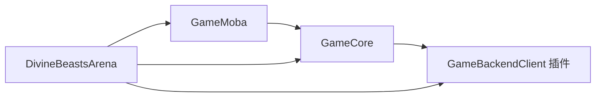

# GameClient项目架构审查报告与优化计划

> 项目：`DBA_GameClient / DivineBeastsArena`
> 审查日期：2026-07-14
> 审查范围：项目根目录、`Source`、`Content`、`Config`、项目级插件、C++ 类型与 Blueprint 暴露边界、Dedicated Server、网络复制、GAS、资源加载与命名
> 审查性质：只读架构审查；本轮未修改源码、配置、资产或关卡，未运行自动化测试、PIE 或自动业务验收

## 1. 完整审查结论

### 1.1 总体评价

**综合评价：一般偏良好，架构方向正确，但尚未达到大型商业化 MOBA+RPG 客户端的稳定基线。**

当前工程已经具备大型项目的关键骨架：客户端与 Dedicated Server Target 分离、`GameCore -> GameMoba -> DivineBeastsArena` 单向模块依赖、C++ 主导的 Gameplay/GAS/网络实现、DataAsset 与软引用入口、ReplicationGraph、后端异步插件、前台状态子系统，以及按 `GameDBA/{Frontend,Gameplay,Presentation,Data,Framework,UI}` 分域的源码目录。与此前平铺式结构相比，方向明显改善。

但“目录已分层”还没有完全转化为“编译边界、运行时边界和职责边界已分层”。目前最突出的问题是：

1. `DivineBeastsArena` 单模块约 5.16 万行，仍承载前台、UI、Gameplay、表现和服务端规则；Dedicated Server 依赖链仍包含 `UMG/Slate`。
2. UI 与前台流程存在超大类：`DBAGameUIManager.cpp` 2173 行、登录 Widget 2042 行、选角/创建 Widget 1130/1255 行。
3. `ADBAZodiacCharacterBase`、`ADBALobbyPlayerController`、`ADBAGameModeBase` 同时承担多个领域职责，存在新的 God Class 风险。
4. Blueprint 暴露面过宽。多项权威状态修改、技能授予、伤害、队伍和比赛统计接口仍是 `BlueprintCallable`，与“Blueprint 仅用于配置和表现”的全局策略不完全一致。
5. 资产路径、UI 类、表现资源、技能 VFX/SFX、复制频率仍存在 C++ 硬编码和同步加载。
6. `Content` 正式域与历史域并存。当前共约 1422 个 `.uasset/.umap`，其中 `/Game/DBA` 567 个；根级历史域仍约 815 个资产，迁移闭环尚未完成。
7. 选角/创建角色 Widget 在 `/Game/DBA/UI/Frontend/Character` 与 `/Game/DBA/UI/Lobby/Character` 各有一套，形成权威路径歧义。
8. 项目禁止自动化脚本，但 `DBA_GameClient/Scripts` 仍残留 CSV、头文件、JSON 与 `__pycache__`，治理规则与磁盘状态不一致。

### 1.2 分项评分

| 维度 | 评分 | 判断 |
| --- | ---: | --- |
| 模块依赖方向 | 8/10 | 未发现 `GameCore -> GameMoba/GameDBA`、`GameMoba -> GameDBA` 或后端插件反向引用，当前无源码级循环依赖。 |
| 目录语义 | 7/10 | `GameDBA` 分域与 `Public/Private` 同构较清晰，但编译模块仍过粗，历史目录尚未收束。 |
| Dedicated Server 边界 | 4/10 | Server Target 存在，但三个运行时模块仍直接或间接依赖 UI 模块，客户端表现没有真正剥离。 |
| C++ / Blueprint 边界 | 6/10 | 核心实现以 C++ 为主，表现事件设计较好；但可变业务接口对 Blueprint 暴露过多。 |
| 数据驱动与资源加载 | 6/10 | 已有 DataAsset、DeveloperSettings、软引用和异步加载；仍有硬编码路径和同步加载兜底。 |
| 网络与 GAS | 7/10 | ASC、AttributeSet、OnRep、RPC、ReplicationGraph 基础完整；复制参数、职责边界和预测链需进一步审查。 |
| UI 架构 | 5/10 | 已有 FlowController 和 WidgetController，但 UIManager/Widget 仍过重，路径和状态管理集中。 |
| 命名一致性 | 6/10 | 正式 DBA 资产多数符合前缀规范；历史资产、C++ 下划线类型、带 `U` 文件名和临时名称仍不一致。 |
| 内容扩展与 DLC 准备度 | 5/10 | 已有 PrimaryAsset 扫描基础，但 AlwaysCook 过宽、Asset Bundle 和 Game Feature 边界不足。 |
| 团队协作与版本控制 | 5/10 | Git LFS 与生成目录忽略规则存在；当前迁移工作区包含大量删除、新增和二进制变更，尚不适合继续叠加大范围重构。 |

## 2. 审查依据与当前快照

### 2.1 工程规模

| 模块 | C++ 文件数 | 约计行数 | 评价 |
| --- | ---: | ---: | --- |
| `GameCore` | 60 | 7626 | 规模可控，但包含账户、会话、UI 和具体后端实现依赖。 |
| `GameMoba` | 17 | 847 | 依赖方向正确，但过薄，尚未承载足够的跨玩法 MOBA 契约。 |
| `DivineBeastsArena` | 380 | 51592 | 项目层过重，是当前主要编译、职责和协作热点。 |

工程包含 256 个 Public 头文件、200 个 Private `.cpp`、15 个测试源码文件。检测到 119 个带 `UDBA` 文件名前缀的源码文件、39 个包含类型式下划线的文件，以及 1 个被提交到源码树中的 `*.generated.h`。

### 2.2 Content 快照

| 根域 | 资产数 | 约计体积 | 判断 |
| --- | ---: | ---: | --- |
| `DBA` | 567 | 687.5 MB | 正式主域，结构正在形成。 |
| `ProjectileHitVFX` | 365 | 187.0 MB | 大型第三方/历史来源，尚未完成正式域归档。 |
| `Animation` | 144 | 0.7 MB | 历史动画域，禁止新增正式引用。 |
| `Blueprints` | 88 | 1.5 MB | 历史 Blueprint 域，与 `/Game/DBA` 双轨。 |
| `UI` | 87 | 1.2 MB | 历史 UI 域，与 `/Game/DBA/UI` 双轨。 |
| `Audio` | 48 | 9.2 MB | 历史音频域。 |
| `VFX` | 48 | 0.1 MB | 历史特效域。 |
| `Characters` | 20 | 92.8 MB | 模板或来源角色域。 |
| `Models` | 12 | 0.2 MB | 旧生肖模型来源域。 |
| `MCP_Generated` | 11 | 2.0 MB | 实验资产，不应成为正式运行时依赖。 |
| `Maps` | 28 | 17.6 MB | 保留地图根域，方向合理。 |

`/Game/DBA` 内部已经形成 `AbilitySets`、`Audio`、`Characters`、`Data`、`Gameplay`、`Input`、`UI`、`VFX`、`Zodiacs` 等正式域。但 `Characters`、`Zodiacs` 和多个旧根域同时存放角色表现资源，仍需完成引用收束。

### 2.3 官方实践基线

本报告以 UE 5.8 官方文档为主要基线：

- [Unreal Engine Modules](https://dev.epicgames.com/documentation/en-us/unreal-engine/unreal-engine-modules)：模块用于封装职责、限制依赖、改善增量编译，并可按 Target/平台排除。
- [Epic C++ Coding Standard](https://dev.epicgames.com/documentation/unreal-engine/epic-cplusplus-coding-standard-for-unreal-engine?lang=en-US)：类型使用前缀和 PascalCase，单词之间通常不使用下划线。
- [Recommended Asset Naming Conventions](https://dev.epicgames.com/documentation/en-us/unreal-engine/recommended-asset-naming-conventions-in-unreal-engine-projects)：推荐 `[AssetTypePrefix]_[AssetName]_[Descriptor]_[Variant]`。
- [Data Assets](https://dev.epicgames.com/documentation/en-us/unreal-engine/data-assets-in-unreal-engine) 与 [Asset Management](https://dev.epicgames.com/documentation/ar-ar/unreal-engine/asset-management-in-unreal-engine)：`UPrimaryDataAsset` 支持 Primary Asset Id、Asset Bundle 和显式加载/卸载。
- [Programming Subsystems](https://dev.epicgames.com/documentation/unreal-engine/programming-subsystems-in-unreal-engine)：Subsystem 应按生命周期提供聚焦职责，避免继续膨胀 GameInstance 或全局管理器。
- [Gameplay Ability System](https://dev.epicgames.com/documentation/unreal-engine/gameplay-ability-system-for-unreal-engine?lang=en-US)：GAS 适合 RPG/MOBA 的属性、技能、效果和异步 Ability Task。
- [Replication Graph](https://dev.epicgames.com/documentation/en-us/unreal-engine/replication-graph-in-unreal-engine)：应按 Actor 行为路由到不同节点，并以持久化节点降低大规模复制开销。
- [Dedicated Server](https://dev.epicgames.com/documentation/unreal-engine/setting-up-dedicated-servers-in-unreal-engine)：服务端是权威主机，不承载本地玩家表现，应保持客户端表现依赖最小化。

## 3. 项目目录结构审查

### 3.1 项目根目录

当前根目录包含 `Build`、`Config`、`Content`、`Docs`、`Exports`、`Plugins`、`Source`、`SourceArt`、`SourceAssets`，以及本地生成目录 `Binaries`、`Intermediate`、`DerivedDataCache`、`Saved`。总体职责可识别，`SourceArt / SourceAssets / Exports` 的分离对美术源文件、导入源和审核导出物有帮助。

问题如下：

| 编号 | 严重度 | 问题 | 影响 | 建议 |
| --- | --- | --- | --- | --- |
| DIR-01 | 高 | `Scripts` 目录仍有 CSV、JSON、头文件和 `__pycache__` 残留 | 与全局自动化脚本禁令冲突，数据来源不清晰 | 将合法数据源迁至 `SourceAssets/Data` 或 `Content/DBA/Data/Tables/Source`；人工确认后删除整个 `Scripts` 残留目录。 |
| DIR-02 | 中 | 客户端局部文档在 `DBA_GameClient/Docs`，全局架构文档在根 `docs` | 同主题文档容易漂移 | 以根 `docs/Architecture` 为架构权威，客户端 `Docs` 只保留与资产交付直接相关的局部说明，并建立索引。 |
| DIR-03 | 低 | 根目录保留一次性构建日志 `build-login-ui-fix.log` | 虽被 `.gitignore` 忽略，仍污染项目根 | 本地日志统一留在 `Saved/Logs`，不作为工程资料。 |

### 3.2 Source 与模块边界

当前依赖方向为：



优点：

- 没有发现 `GameCore` 反向引用 `GameMoba/GameDBA`。
- 没有发现 `GameMoba` 反向引用 `GameDBA`。
- `GameBackendClient` 没有引用项目游戏模块，可独立复用。
- `Public/Private` 目录结构已建立，项目层 `GameDBA` 分域清晰。

主要问题：

| 编号 | 严重度 | 证据 | 判断与影响 |
| --- | --- | --- | --- |
| MOD-01 | 高 | `GameCore.Build.cs` Public 依赖 `UMG`，Private 依赖 `Slate/SlateCore/HTTP/Json/GameBackendClient`；`GameMoba.Build.cs` 也依赖 `UMG/Slate` | Core 与 MOBA 基础层混入表现和具体基础设施，Dedicated Server 无法获得干净依赖图。 |
| MOD-02 | 高 | `DivineBeastsArena.Build.cs` Public 依赖 `UMG/Niagara/ReplicationGraph`，仅在 Server 下排除 Render/Audio/Media | UI、表现和服务端规则位于同一模块；条件编译不足以替代模块边界。 |
| MOD-03 | 高 | `DivineBeastsArena` 约 5.16 万行，远大于另外两模块总和 | 单模块编译热点、Public API 扩散、多人修改冲突和 Dedicated Server 裁剪困难。 |
| MOD-04 | 中 | `GameMoba` 仅 847 行，主要是基础 GameMode、ASC、Ability、RPC 和 UI 基类 | MOBA 通用层尚未承担 Teams、Damage Contract、Targeting、Match State、HUD Protocol 等跨玩法契约。 |
| MOD-05 | 中 | `.uproject` 对三个模块使用 `AdditionalDependencies`，而 `Build.cs` 已声明依赖 | 官方文档建议依赖放在 `Build.cs`；双处维护容易漂移。 |
| MOD-06 | 中 | `ADBAPlayerState.h` Public 直接包含 `GameBackendRuntimeService.h` 并返回后端 DTO | Gameplay Framework 公共类型泄漏具体后端协议，后端 DTO 变化会触发游戏模块重编译并扩大耦合。 |
| MOD-07 | 中 | `GameCore` 的登录子系统和账户服务直接获取 `UDBA_GameBackendClientSubsystem` | 抽象层依赖具体实现。应由接口/端口定义能力，再由插件或项目层注入实现。 |

### 3.3 三层架构映射

当前目录已接近 Presentation / Logic / Data，但并非严格三层；对 UE 大型多人游戏，更适合采用“领域模块 + 分层边界”组合。

| 层 | 当前目录 | 当前评价 | 目标边界 |
| --- | --- | --- | --- |
| Presentation | `GameDBA/UI`、`GameDBA/Presentation`、UMG/AnimBP/VFX | 目录已分离，编译模块未分离 | 仅客户端模块；消费事件和只读 ViewModel，不修改权威状态。 |
| Application / Flow | `GameDBA/Frontend`、`UI/Frontend/DBAFrontendFlowController`、Subsystem | 已有雏形，仍被 UIManager/Widget 包围 | 编排异步 Use Case、状态机和 Travel；不创建具体 Widget。 |
| Domain / Logic | `GameDBA/Gameplay`、`Characters`、`GameMoba` | C++ 主导，但项目层过重 | 服务器权威、GAS、伤害、队伍、目标选择、地图规则。 |
| Data / Configuration | `GameDBA/Data`、DeveloperSettings、`/Game/DBA/Data` | 已有软引用和注册表，路径硬编码仍存在 | PrimaryDataAsset/Registry 为唯一入口，Asset Bundle 管理加载与分包。 |
| Infrastructure | `GameBackendClient`、OnlineSubsystem、HTTP/Json | 插件化是优点，但抽象依赖倒置不足 | 游戏层依赖接口；插件实现异步网络、重试、取消和错误映射。 |

## 4. Content 与资源组织审查

### 4.1 做得好的部分

- `/Game/DBA` 已成为正式主域，`/Game/Maps` 被明确保留为地图根域。
- `/Game/DBA/Zodiacs/Chinese` 已建立 12 个正式 AnimBP、网格和材质组织方式。
- 十二生肖注册表、选角数据、战斗属性默认值和英雄成长默认值已迁往 `Registries/Progression`。
- `.gitattributes` 已为 `.uasset/.umap`、源美术和音视频配置 Git LFS。
- `DefaultEngine.ini` 已配置 Map、HeroData、AbilitySet 和 DBAData 的 Primary Asset 扫描入口。

### 4.2 主要问题

| 编号 | 严重度 | 证据 | 建议 |
| --- | --- | --- | --- |
| CNT-01 | 高 | 根级 `Animation/Blueprints/UI/VFX/Audio/Models/ProjectileHitVFX` 仍约 815 个资产 | 按 Asset Registry 引用清单分批迁移；禁止文件系统移动；每批 Fix Redirectors、Compile、Save、人工审核。 |
| CNT-02 | 高 | 选角/创建角色 Widget 同时存在于 `UI/Frontend/Character` 和 `UI/Lobby/Character` | 选择一个权威域。建议前台流程统一使用 `/Game/DBA/UI/Frontend/Character`，旧 Lobby 路径只保留 Redirector，禁止双路径回退。 |
| CNT-03 | 高 | `DBAGameUIManager.cpp` 直接硬编码约 18 个 WBP 路径 | 新建 `UDBAUIFlowRegistry : UPrimaryDataAsset`，由 DeveloperSettings 只引用该 Registry；运行时异步加载 Widget Class。 |
| CNT-04 | 高 | `DefaultGame.ini` AlwaysCook 整个 `/Game/DBA/UI`、Audio SFX、VFX 和 Rosales | 以 PrimaryAsset Label / Asset Bundle / 地图引用作为 Cook 权威；AlwaysCook 仅保留启动地图和不可避免的启动资源。 |
| CNT-05 | 中 | `MCP_Generated/AI_Showcase` 仍有 11 个实验资产 | 迁至 `/Game/DBA/Experimental/AI_Showcase` 或在引用确认后退役；不得被正式 Registry、地图和 Cook 标签引用。 |
| CNT-06 | 中 | `ProjectileHitVFX` 365 个资产、187 MB，正式域只迁入部分 LegacyProjectile | 建立第三方来源清单、许可证、已采用子集和未采用子集；只迁移被正式技能引用的资源。 |
| CNT-07 | 中 | `DefaultAndCanBeDelete`、`DBAElementResonanceRowe`、`SkillDataTable` 等名称仍在磁盘或历史配置 | 经引用审查后重命名或退役，严禁直接删除二进制资产。 |
| CNT-08 | 中 | PrimaryAsset `HeroData` 只扫描 `/Game/DBA/Data`，而实际角色数据还分布于 `Heroes`、`Zodiacs`、`Gameplay` | 统一 PrimaryAsset 类型与目录；避免多个 PrimaryAsset 类型扫描同一基类和重叠目录。 |

### 4.3 面向 DLC、赛季和跨平台的建议

- 英雄/生肖默认以 PrimaryDataAsset + Asset Bundle 管理，不建议为每个英雄建立 C++ 模块。
- 新地图模式可在规则成熟后使用 Game Feature Plugin；首要目标是先稳定核心模块和资产注册表。
- Bundle 建议至少区分 `ClientVisual`、`ServerRules`、`Frontend`、`Arena`、`Mobile`、`HighQuality`。
- 移动端纹理、音频和 Niagara 变体通过 Device Profile、平台 DataAsset 字段或 Cook Rule 选择，不复制业务逻辑。
- 赛季内容使用 PrimaryAsset Label 或独立内容插件，禁止依靠扩大 `DirectoriesToAlwaysCook` 实现“全部打包”。

## 5. 命名规范审查

### 5.1 C++ 命名

优点：类型普遍使用 `U/A/F/E/I` 前缀，项目类型统一带 `DBA`，函数和属性大多使用 PascalCase，反射宏位置基本符合 UE 习惯。

问题与规则：

| 当前示例 | 问题 | 推荐 |
| --- | --- | --- |
| `UDBALoginFlowWidgetBase.cpp` | 文件名带 `U`，但 `DBAGameUIManager.cpp` 等又不带反射前缀，规则不一致 | 新文件统一不带 `U/A/F/E/I` 前缀，例如 `DBALoginFlowWidgetBase.cpp`；旧文件只在独立重命名批次处理。 |
| `DBAProjectile_Generic`、`DBAGE_Generic`、`DBAGuardian_Crystal` | C++ 类型使用下划线分词，不符合 Epic PascalCase 习惯 | `DBAGenericProjectile`、`DBAGenericGameplayEffect`、`DBACrystalGuardian`。 |
| `EDADeathState` | 项目前缀缺少 `B`，与 `EDBA...` 系列不一致 | `EDBADeathState`；属于反射类型重命名，必须配 Core Redirect 并审查 Blueprint/DataTable 引用。 |
| `DBAGameplayAbilities_AutoGenerated.generated.h` | 手工源码树出现 UHT 风格 `generated.h`，极易与真实生成文件混淆 | 将手工公共宏/声明改为普通头文件名；UHT 生成文件只存在于 Intermediate。 |
| `DBAConstants.h` 约 464 行 | “Constants” 容易成为硬编码收容点 | 只保留协议键和编译期技术常量；业务数值、文案和资产路径迁至数据资产/Settings。 |

建议统一规则：

```text
类型：UDBAFrontendFlowController / ADBAZodiacCharacter / FDBAMatchStats / EDBADeathState
文件：DBAFrontendFlowController.h/.cpp（不携带 U/A/F/E 前缀）
接口：IDBATeamAgentInterface，文件 DBATeamAgentInterface.h
函数：SubmitLogin、ApplyDamage、HandleHealthChanged
布尔：bIsSubmitting、bCanInteract
Delegate：FOnHealthChanged / OnHealthChanged
RPC：ServerRequestCast、ClientNotifyFailure、MulticastPlayCosmeticCue
```

### 5.2 Content 命名

推荐格式：`[类型前缀]_DBA_[领域]_[名称]_[描述/变体]`。

| 资产类型 | 推荐前缀 | 示例 |
| --- | --- | --- |
| Actor Blueprint | `BP_` | `BP_DBA_CharacterPresentationActor` |
| Widget Blueprint | `WBP_` | `WBP_DBA_Login` |
| Animation Blueprint | `ABP_` | `ABP_DBA_Zodiac_Rat` |
| Primary Data Asset | `DA_` | `DA_DBA_ZodiacCharacterRegistry` |
| DataTable | `DT_` | `DT_DBA_ZodiacSkillDefinitions` |
| Material / Instance | `M_` / `MI_` | `M_DBA_RuntimeTint`、`MI_DBA_Zodiac_Rat` |
| Skeletal Mesh | `SKM_` | `SKM_DBA_Zodiac_Rat` |
| Skeleton | `SKEL_` | `SKEL_DBA_Zodiac_Humanoid` |
| Niagara System | `NS_` | `NS_DBA_Fireball_Impact` |
| Sound / MetaSound / Cue | `SFX_`、`BGM_`、`MS_`、`SC_` | `SFX_DBA_UI_ButtonClick` |
| Map | `L_` | `L_DBA_Lobby` |
| Input Action / Mapping | `IA_` / `IMC_` | `IA_DBA_BasicAttack` |

不建议在正式资产名中使用 `Default`、`CanBeDelete`、`Temp`、`Final`、`New`、`V2/V3`、导入批次号 `_22496`。第三方原名可在来源域保留，进入正式域时按项目规则命名。

## 6. C++ 类设计与 Blueprint 继承审查

### 6.1 继承体系的合理部分

当前核心继承方向总体合理：

```text
AGameModeBase
└─ ADBAMobaGameModeBase
   └─ ADBAGameModeBase

ACharacter + IAbilitySystemInterface
└─ ADBACharacterBase
   ├─ ADBAZodiacCharacterBase      # 玩家 ASC 位于 PlayerState
   └─ ADBAMonsterBase              # AI ASC 位于自身

UAbilitySystemComponent
└─ UDBAMobaAbilitySystemComponentBase
   └─ UDBAAbilitySystemComponent

UGameplayAbility
└─ UDBAMobaGameplayAbilityBase
   ├─ UDBAZodiacAbilityBase
   ├─ UDBAElementAbilityBase
   └─ UDBAResonanceAbilityBase
```

`PlayerState` 持有玩家 ASC 能让技能、效果和冷却跨 Pawn 重生持续，符合多人 GAS 常见做法；AI 在自身持有 ASC 也合理。AttributeSet 使用 `ReplicatedUsing`，角色通过 Attribute Delegate 驱动 HUD，方向符合事件驱动策略。

### 6.2 God Class 与职责泄漏

| 类 | 规模/职责 | 问题 | 推荐拆分 |
| --- | --- | --- | --- |
| `UDBAGameUIManager` | 2173 行；管理登录、选创角、大厅、Arena HUD、设置、背包、队伍、匹配、交互、音频、输入模式、重试和 Widget 创建 | 全局 UI 服务定位器和 Screen Factory，改动冲突高 | 保留薄 Facade；提取 `UIRootSubsystem`、`UIScreenStack`、`UIFlowRegistry`、`FrontendFlowPresenter`、`LobbyOverlayService`、`ArenaHUDPresenter`。 |
| `UDBALoginFlowWidgetBase` | 2042 行；布局、资源加载、输入绑定、状态、动作、视觉修正 | View 承担 Presenter 与资产加载职责 | Widget 只绑定控件和播放表现；动作进 `FrontendFlowController`，显示模型进 `LoginViewModel/Presenter`，样式进 DataAsset。 |
| `UDBACharacterSelect/CreateFlowWidgetBase` | 1130/1255 行；预览、数据加载、旋转、音频、提交、布局 | 选角业务和固定关卡表现耦合 | 提取 `CharacterSelectionUseCase`、`CharacterPresentationController`、`CharacterSelectionViewModel`。 |
| `ADBAZodiacCharacterBase` | 1566 行；GAS、输入桥、技能、相机、动画、HUD、死亡、队伍、观战、表现加载 | 角色基类过宽，前台与 Arena 职责混合 | 拆为 Ability/Loadout、LobbyPresentation、Animation、Death、Team、HUD Binding 组件；HUD 绑定移出 Character。 |
| `ADBALobbyPlayerController` | 1240 行；鼠标、触控、相机、UI、战斗输入、目标选择、异步输入资源 | 输入设备和玩法控制混合 | `DBAInputRouterComponent`、`DBACameraControllerComponent`、`DBATargetSelectionComponent`、`DBAUICommandComponent`。 |
| `ADBAGameModeBase` | 968 行；玩家加入、角色生成、大厅展示、训练怪、后端心跳和比赛结果 | Server 规则、场景生成和后端基础设施耦合 | `DBALobbySpawnService`、`DBAMatchLifecycleService`、`DBABackendMatchReporter`；GameMode 只编排生命周期。 |
| `ADBAPlayerState` | GAS + 比赛统计 + 后端 DTO 构建 | 公共 Gameplay 类型依赖后端协议 | PlayerState 输出 `FDBAMatchResultSnapshot`；后端适配器负责 DTO 映射。 |

### 6.3 Blueprint 职责边界

当前存在 208 个 `WBP_`、29 个 `ABP_`、26 个 `BP_`、59 个 `DA_`。从 C++ 契约看，项目已大量使用 `BlueprintImplementableEvent` 承接 UI 展示事件，这是合理方向；例如 Buff、Debuff、技能槽、公告、目标和连接状态等 Widget 由 C++ 状态更新后通知 Blueprint 播放表现。

但权威修改接口暴露过宽：

- `ADBAPlayerState::RecordKill/RecordDeath/AddMatchScore/SetMatchResult` 是 `BlueprintCallable`。
- `ADBAZodiacCharacterBase::CastEquippedSkill/SetUltimateEnergy/OnDeath/OnRevive/SetTeamID` 是 `BlueprintCallable`。
- `UDBAAbilitySystemComponent` 的技能授予、能量、连击、共鸣和冷却接口大量 `BlueprintCallable`。
- `UDBADamageCalculator` 和 Monster AI 也暴露了大量可执行接口。

按照本项目“C++ 负责逻辑、Blueprint 只负责配置和表现”的硬约束，应执行以下规则：

1. Blueprint 只保留只读查询、表现事件、DataAsset 选择和资源引用。
2. 权威状态变更接口取消 `BlueprintCallable`，改为 C++ 私有/受保护 API，由 Ability、Subsystem、Controller 或服务器服务调用。
3. 必须供设计师触发的表现接口使用 `BlueprintCosmetic` 或明确的 `On...` 事件，不得改 Gameplay 状态。
4. `BlueprintReadWrite` 的运行时状态改为 `BlueprintReadOnly`；可配置字段优先 `EditDefaultsOnly`，避免实例级任意修改。
5. Widget Blueprint 必须继承对应 C++ View Base，但其 Event Graph 不得包含登录、伤害、冷却、队伍、Travel 或后端调用逻辑。

### 6.4 Blueprint 继承关系的审查边界

本轮未启动 Editor，也未直接解析或修改二进制 `.uasset`，因此不能把以下事项表述为已确认：

- 每个 WBP/BP 的真实 Parent Class。
- Event Graph 中是否仍有业务逻辑、Tick、Delay、HTTP 或 Travel。
- Widget Tree 绑定、动画和接口实现是否完整。
- 重复资产之间的 Redirector 和引用方向。

后续必须通过 Unreal Editor + MCP 做只读人工审查：逐个输出 Parent Class、Implemented Interfaces、Event Graph 节点统计、Tick/Timer/Delay、硬引用、Compile 状态和引用者；人工确认后才能执行资产改名或迁移。

## 7. 网络、GAS、性能与内存审查

### 7.1 网络与 Dedicated Server

优点：

- 已有 `DivineBeastsArenaServer.Target.cs`，服务器 Shipping 保留日志。
- `ADBACharacterBase` 复制死亡状态、队伍和移动；`ADBAPlayerState` 复制比赛统计。
- 技能调用包含 Server RPC 校验，表现使用 Unreliable Multicast，基础方向合理。
- ReplicationGraph 已启用，并区分全局相关 Actor 与空间 Actor。

风险：

| 编号 | 严重度 | 问题 | 建议 |
| --- | --- | --- | --- |
| NET-01 | 高 | Server Target 的模块依赖仍携带 UMG/Slate 和大量 UI 类 | 建立 ClientOnly 模块，并在 `.uproject` 使用 Target Include/Exclude；Server 只链接 Core、MobaRuntime、DBARuntime、BackendRuntime。 |
| NET-02 | 高 | `ADBACharacterPreviewActor` 设置 `bReplicates=true` | 若只用于本地固定选角关卡，应禁用复制；展示状态由本地 ViewModel 驱动。 |
| NET-03 | 中 | RepGraph 将角色 30Hz、投射物 20Hz、PlayerState 10Hz、CellSize 10000 写死在 C++ | 建立 `UDBAReplicationGraphSettings` 或地图/模式 DataAsset；按 Arena/Lobby/Training 配置。 |
| NET-04 | 中 | `StaticSpatialNode` 被创建但未加入全局节点，也未用于路由 | 删除死结构，或实现静态 Actor 专用路由并验证收益。 |
| NET-05 | 中 | `ADBAPlayerState` 七个字段都使用同一个 `OnRep_MatchStats` | 合并为复制结构 `FDBAMatchStats`，一次 OnRep 后广播字段级事件，减少重复刷新。 |
| NET-06 | 中 | GameMode 直接负责后端心跳、玩家加入离开、结果上报 | 抽到 Server-only Match Reporter，提供幂等、超时、取消和错误状态，不污染规则类。 |

### 7.2 GAS

GAS 架构基础较完整：玩家 ASC 位于 PlayerState，AI ASC 位于自身，AttributeSet 有 OnRep，项目 ASC 继承 MOBA ASC，技能基础类按 Zodiac/Element/Resonance 分类，并有 AbilitySet 和 FixedSkillGroup 数据入口。

需要优化：

- 将技能规则、消耗、冷却、伤害和状态授予继续收束到 GameplayAbility/GameplayEffect/ExecutionCalculation/AbilityTask，避免 Actor Spell 类并行实现第二套技能框架。
- `DBABloomHealingSpell`、`DBAChainLightningSpell`、`DBAHolyShieldSpell` 直接持有并播放大量 VFX/SFX，应把规则与表现分离；表现优先通过 GameplayCue 或表现组件消费事件。
- 权威 ASC 变更接口不应对 Blueprint 开放。
- 核验 ASC Replication Mode、Net Execution Policy、Prediction Key、失败回滚和 TargetData 验证；当前仅凭静态目录不能确认所有能力配置正确。
- `SkillCooldowns` 等观战数组若未来扩展为大量动态技能，应考虑 Fast Array；固定 6 槽可保留普通数组但应避免每帧同步。

### 7.3 Tick、同步加载与 GC

问题证据：

- `ADBACharacterBase` 默认开启 Tick，导致所有角色和怪物继承后默认每帧更新。
- `ADBAZodiacCharacterBase`、训练怪、Guardian、多个 Projectile 和 Character Preview 使用 Tick。
- UI、选角预览、GameMode、Startup/Splash、Inventory/Settings 中仍存在 `TryLoad/LoadSynchronous`。
- `DBAGameUIManager` 持有大量 Widget 强引用和可见状态布尔值，销毁、世界切换和 LocalPlayer 生命周期需要更清晰的归属。

建议：

1. `ADBACharacterBase` 默认 `bCanEverTick=false`；仅需要本地移动/动画桥接的具体类按状态启用 Tick。
2. Projectile 优先使用 ProjectileMovement、碰撞事件、Timer 或 AbilityTask；只有确需逐帧轨迹时才 Tick。
3. Preview 旋转只在拖拽或自动旋转开启时 Tick；前台预览不复制。
4. 所有运行时资源通过 Asset Manager 异步加载；构造函数和 UI 显示路径不允许 `TryLoad/LoadSynchronous`。
5. UI 实例由 LocalPlayer Subsystem 或 CommonUI Layer Stack 管理；世界级对象使用弱引用，切关时显式解绑 Delegate 和取消 StreamableHandle。
6. 通过 Unreal Insights 人工采样 GameThread、Slate、GC、Net 和 AssetLoad；没有采样数据前不把静态审查结论当成性能验收。

## 8. MOBA+RPG 适配性评估

| 能力域 | 当前支持度 | 评价 |
| --- | --- | --- |
| 英雄/生肖选择 | 中高 | Registry、Selection DataAsset、正式生肖资源域和固定前台流程已存在；重复 WBP 和同步加载需消除。 |
| 技能与战斗 | 中高 | GAS、AttributeSet、AbilitySet、FixedSkillGroup、Projectile、Cue 基础完整；Actor Spell 与 GAS 表现链有重复风险。 |
| 队伍与目标选择 | 中 | TeamID、Targeting 类型和基础接口存在；应把通用契约下沉 GameMoba，并加强服务端校验。 |
| 装备/物品/构筑 | 中低 | 有 Inventory UI、Loadout 和技能目录，但完整服务器权威 Item/Inventory/Equipment 领域模型尚不清晰。 |
| 成长与局内等级 | 中 | HeroGrowth AttributeSet 和默认值 DataAsset 已有；赛后成长、持久化和后端一致性仍需领域契约。 |
| 地图规则/分线/野区 | 低到中 | MapRules 和导航入口存在，但 Lane、Spawn、Objective、Jungle、Wave 等通用 MOBA 服务尚未形成独立模块。 |
| 匹配/会话/重连 | 中 | Party、Queue、ReadyCheck、Backend Session 与 Reconnect 已有；UI 和 Core 对具体后端耦合偏高。 |
| Dedicated Server | 中 | Target、权威 GameMode、ReplicationGraph 和后端 Runtime 存在；服务端模块裁剪和网络参数数据化不足。 |
| 社交/商城/任务/赛季 | 中低 | 后端插件已有多类服务，但客户端领域层与 UI 仍需稳定接口、缓存和错误状态模型。 |
| DLC/热更新 | 低到中 | PrimaryAsset 扫描已起步；AlwaysCook、Asset Bundle、内容插件和版本兼容策略未闭环。 |

## 9. 推荐目标架构

### 9.1 渐进式模块目标

不建议立即把 5 万行项目层一次性拆成十余模块。推荐先保持现有三个模块名称，通过依赖清理和 Facade 过渡，再逐步形成下列目标：

```text
Source/
├─ GameCore/                       # 无 UMG、无具体后端；Async、Types、Data、Session 接口
├─ GameCoreUI/                     # 客户端通用 UI 基类、LocalPlayer UI 生命周期
├─ GameMoba/                       # Combat、GAS、Targeting、Teams、Match、Networking 契约
├─ GameMobaUI/                     # MOBA HUD 协议与 WidgetController 基类
├─ DivineBeastsArena/              # 项目启动与最薄组合根
├─ DBAFrontend/                    # Auth、CharacterSelection、Lobby 前台流程，ClientOnly
├─ DBAGameplay/                    # Zodiac、Monster、Abilities、Items、Progression、MapRules
├─ DBAPresentation/                # Animation、Audio、VFX、UI Widgets，ClientOnly
└─ DBAEditor/                      # Editor 动画/资产工具，EditorOnly

Plugins/
├─ GameBackendClient/              # 异步 HTTP/会话/平台基础设施
└─ GameFeatures/                   # 中长期：新模式、赛季或 DLC 内容插件
```

依赖方向：

```text
DBAEditor ------------------------------> 项目运行时模块（仅 Editor）
DBAPresentation -> DBAFrontend/DBAGameplay -> GameMoba -> GameCore
GameMobaUI ------> GameMoba + GameCoreUI
DBAFrontend -----> GameCore 接口 + GameBackendClient 适配器
DBAGameplay -----> GameMoba + GameCore
Dedicated Server 仅包含 GameCore + GameMoba + DBAGameplay + Backend Runtime
```

### 9.2 推荐 Content 结构

```text
Content/
├─ DBA/
│  ├─ Data/
│  │  ├─ Registries/
│  │  ├─ Heroes/
│  │  ├─ Abilities/
│  │  ├─ Items/
│  │  ├─ MapRules/
│  │  └─ UIFlows/
│  ├─ Zodiacs/Chinese/
│  │  ├─ Data/
│  │  ├─ Visuals/{Meshes,Materials,Skeletons}/
│  │  ├─ Animations/
│  │  └─ Blueprints/               # 仅 C++ 子类配置外壳
│  ├─ Gameplay/{Abilities,Items,Progression,Objectives}/
│  ├─ UI/{Frontend,Lobby,HUD,Common,Fonts}/
│  ├─ Audio/{UI,SFX,Music}/
│  ├─ VFX/{Common,Abilities,Environment}/
│  └─ Experimental/                # 仅审批中的实验资产
└─ Maps/{Frontend,Lobby,Arena,Training}/

SourceArt/{Characters,UI,VFX,Audio}/
SourceAssets/{Import,References,Data}/
Exports/{Approved}/
```

## 10. 详细优化执行计划

### 阶段 0：建立可审查基线（P0，1 至 2 人日）

目标：不继续在迁移中的工作区叠加结构性改动。

1. 记录当前迁移文件清单，区分“文件移动”“逻辑修改”“资产迁移”“生成物删除”。
2. 将合法数据源从 `Scripts` 迁往 `SourceAssets/Data` 或 `Content/DBA/Data/Tables/Source`；人工确认后清理 `Scripts` 与 `__pycache__`。
3. 更新目录与命名登记表，明确 `/Game/DBA/UI/Frontend/Character` 为选创角 UI 唯一权威域。
4. 对当前三 Target 分别做工程编译检查；编译只证明工程可链接，不替代业务人工验收。
5. 形成一次可回退的 Git 检查点，再进入下一批重构。

收益：降低当前大量删除/新增状态下的误覆盖风险，为后续逐批迁移提供基线。

### 阶段 1：修复高风险边界（P0，4 至 8 人日）

1. 新建 `UDBAUIFlowRegistry` PrimaryDataAsset，迁移 UIManager 中所有 WBP 硬编码路径，改为异步加载。
2. 消除运行时 `TryLoad/LoadSynchronous`，优先处理前台、UIManager、CharacterPresentation、GameMode 和 Startup/Splash。
3. Dedicated Server 构建先用条件依赖去除可排除的 Render/Audio/UI，再创建 `GameCoreUI` 或 `DBAPresentation` ClientOnly 模块作为真正边界。
4. 将 PlayerState 的后端 DTO 映射移至 Server Match Reporter，Public Gameplay 头文件不包含插件 DTO。
5. 收紧 Blueprint API：先处理 PlayerState、ASC、Character 的权威状态修改函数。
6. 将 RepGraph 频率、CellSize 和类路由配置迁至 Settings/DataAsset；移除未使用 StaticSpatialNode 或补齐实现。

验收：Editor/Client/Server 均能编译；Editor 中人工检查 Widget Parent Class 和 Compile；Dedicated Server 模块清单不再包含 UMG/Slate；人工登录、选角、创建角色、进入大厅流程不变。

### 阶段 2：拆分 God Class（P1，8 至 15 人日）

1. 以现有 `UDBAFrontendFlowController` 为起点，提取 Auth、CharacterList、CreateCharacter 异步 Use Case 与只读 ViewModel。
2. 将 `UDBAGameUIManager` 降为兼容 Facade；建立 Screen Stack、UI Registry、Lobby Overlay 和 Arena HUD Presenter。
3. 登录/选角/创建 Widget 只保留 NativeConstruct、控件绑定、显示状态和动画事件。
4. 拆分 `ADBALobbyPlayerController` 的输入、相机、目标选择和 UI 命令组件。
5. 拆分 `ADBAZodiacCharacterBase` 的大厅表现、HUD 桥、动画和技能/构筑组件。
6. 拆分 `ADBAGameModeBase` 的 Spawn、Match Lifecycle 和 Backend Reporter。

验收：单个 UI/流程实现类建议不超过 500 至 800 行；Widget 不直接访问后端；角色不直接操作 HUD Manager；GameMode 不构建后端 DTO。

### 阶段 3：内容与数据资产收束（P1，10 至 25 人日，按批次）

1. 使用 Asset Registry 输出旧域引用者，按“生肖、UI、VFX、Audio、Blueprint”分批迁移。
2. 选角/创建重复 WBP 只保留权威版本，旧路径 Fix Redirectors 后退役。
3. `ProjectileHitVFX` 只迁移实际使用子集，并记录许可证与来源。
4. 统一 Hero/Ability/Item/MapRule/UIFlow PrimaryAsset 类型，建立 Asset Bundle 和 PrimaryAssetLabel。
5. 将 AlwaysCook 收缩到启动地图、启动 Registry 和无法通过引用收集的最小资源。
6. 按命名迁移表重命名临时资产、批次尾缀和错误前缀；每批都保留 Redirector 并人工打开引用地图/Widget。

验收：新增正式资源只进入 `/Game/DBA` 或 `/Game/Maps`；根级旧域不再有正式运行时引用；Cook 清单能解释每个强制资源来源。

### 阶段 4：MOBA/RPG 与长期扩展（P2，15 至 30+ 人日）

1. 将 Teams、Targeting、Damage IO、Match State、Objective、Lane/Wave/Jungle 契约逐步下沉 `GameMoba`。
2. 建立权威 Item/Inventory/Equipment/Loadout/Progression 领域模型，客户端只做预测和展示。
3. 为技能建立统一 GameplayCue、AbilityTask、TargetData 和 Prediction 策略，退役并行 Actor Spell 逻辑。
4. 以 Unreal Insights 和网络仿真人工审核 RepGraph、Dormancy、NetUpdateFrequency、RPC 与 GAS 带宽。
5. 在核心稳定后引入 Game Feature Plugin 承载新模式、赛季或 DLC；英雄常规内容继续使用 PrimaryDataAsset。
6. 建立跨平台 Asset Bundle、Device Profile、内存预算、Shader/PSO 和 Cook 分包规则。

## 11. 优先级总表

| 优先级 | 工作项 | 预计工作量 | 直接收益 |
| --- | --- | ---: | --- |
| P0 | 清理 `Scripts` 治理残留并建立迁移检查点 | 1 至 2 人日 | 恢复规则与磁盘一致性，降低误操作风险。 |
| P0 | UI 路径 Registry + 异步加载 | 2 至 4 人日 | 消除硬编码和同步阻塞，支持 UI 资产迁移。 |
| P0 | Dedicated Server 去 UI 依赖 | 3 至 6 人日 | 降低 Server 包体、启动依赖和客户端代码耦合。 |
| P0 | 收紧 Blueprint 权威写接口 | 2 至 4 人日 | 落实 C++ 权威逻辑与安全边界。 |
| P1 | 拆分 UIManager 与前台 Widget | 5 至 10 人日 | 解决登录流程反复补丁和多人冲突。 |
| P1 | 拆分 Character/Controller/GameMode | 8 至 15 人日 | 提升 Gameplay 可维护性、测试性和网络边界。 |
| P1 | Content 旧域分批迁移 | 10 至 25 人日 | 唯一资产权威、减少 Cook 与引用歧义。 |
| P2 | Asset Bundle / Game Feature / 平台变体 | 15 至 30+ 人日 | 支持新模式、赛季、DLC 和跨平台。 |

## 12. 后续人工验证与所需补充信息

### 12.1 后续验证方式

受 `DBA.Validation.ManualReviewOnly` 和 `DBA.AutomationScript.Prohibited` 约束，后续验证必须区分：

- **工程检查**：Client/Editor/Server 编译、静态检索、Git Diff、资产 Compile/Save 状态。
- **人工业务审核**：人工操作登录、选角、创建角色、进入大厅、技能、重连和双客户端联机，记录画面与日志。
- **性能人工审核**：人工启动目标场景并采集 Unreal Insights、Network Profiler、MemReport、Cook Report。

不得用自动登录、自动点击、自动 Travel、自动 PIE 或脚本断言替代人工结论。

### 12.2 仍需 Editor 侧补充的事实

1. 208 个 WBP、26 个 BP、29 个 ABP 的 Parent Class 和 Compile 状态。
2. Blueprint Event Graph 中是否存在权威 Gameplay、HTTP、Travel、Tick、Delay 或 Timer。
3. 两套选创角 WBP 的引用者和 Redirector 状态。
4. PrimaryAssetId、Asset Bundle、Chunk、Cook Rule 和实际 Cook 体积。
5. GAS Ability 的 Net Execution Policy、Instancing Policy、Replication Mode 与 Prediction 行为。
6. RepGraph 在大厅和 Arena 的实际 Actor 数、连接数、Server CPU 和带宽。
7. Android/Windows 的 Device Profile、纹理组、Niagara Scalability、Shader/PSO 和内存预算。

## 13. 建议的下一步具体行动

**下一步直接执行“阶段 0 + 阶段 1 的第一批”：先建立当前迁移检查点，再创建 UI Flow Registry 的 C++ 类型和 DataAsset 契约，将 `DBAGameUIManager` 中硬编码的 Widget 路径迁出；同时保持旧 API 作为临时 Facade，确保登录、选角、创建角色和大厅流程不发生行为变化。**

该批次改动范围小、收益高，并为后续拆分 UIManager、清理重复 WBP 和 Dedicated Server 去 UI 依赖建立稳定入口。完成后再按本计划逐批推进，不进行一次性源码或资产大迁移。

## 14. 阶段 1 第一批执行记录（2026-07-14）

### 14.1 已完成事项

1. 新增 `UDBAUIFlowRegistry` C++ PrimaryDataAsset 契约，集中声明登录、选角、创建角色、启动视频、主大厅、大厅 HUD、各大厅覆盖层和 Arena HUD 的 Widget 类软引用。
2. `UDBAUIDeveloperSettings` 新增 `DefaultUIFlowRegistry`，有效配置指向 `/Game/DBA/Data/Registries/DA_DBA_UIFlowRegistry`。
3. `UDBAGameUIManager` 构造函数不再同步解析或加载 Widget Blueprint；已移除其中全部 `WBP_DBA` 路径、`TryLoadClass`、`TryLoad` 与 `ConstructorHelpers::FClassFinder`。
4. UI 初始化改为两阶段异步加载：先加载 Registry 数据资产，再批量加载 Registry 中的 Widget 类；加载完成后才刷新前端状态并进入启动视频/登录流程。
5. 保留 `UDBAGameUIManager` 既有公开 API 作为兼容 Facade，未改变登录、选角、创建角色和大厅调用方接口。
6. Registry 缺失或个别类加载失败时，仅对原来已有原生兜底的关键界面使用 C++ Widget 基类；所有失败信息使用中文日志输出。
7. 通过 Monolith `seed_data_asset` 在 Undo Transaction 中创建并保存 `/Game/DBA/Data/Registries/DA_DBA_UIFlowRegistry`，20 个 Widget 字段严格反射校验均通过。
8. Registry 继承项目统一的 `UDBADataAssetBase`，复用 `/Game/DBA/Data` 现有 `DBAData` PrimaryAsset 扫描规则；未新增或扩大 `DirectoriesToAlwaysCook`。

### 14.2 工程检查证据

| 检查项 | 结果 | 说明 |
| --- | --- | --- |
| Registry 反射 dry-run | 通过 | 20/20 字段可写，`errors=0`，未在 dry-run 阶段创建资产。 |
| Registry 创建与回读 | 通过 | `saved=true`，20/20 字段回读值与配置一致。 |
| Editor 重启后资产文本回读 | 通过 | Registry 可重新加载，T3D 导出匹配 20 个 `WidgetClass` 字段。 |
| Monolith 资产查询 | 通过 | 资产类型为 `DBAUIFlowRegistry`，路径为 `/Game/DBA/Data/Registries/DA_DBA_UIFlowRegistry`。 |
| DeveloperSettings 有效值 | 通过 | `DefaultUIFlowRegistry` 已解析为新 Registry 资产路径。 |
| `DivineBeastsArenaEditor Win64 Development` | 编译成功 | UHT 写入 7 个生成文件，Editor DLL 链接成功。 |
| `DivineBeastsArenaServer Win64 Development` | 编译成功 | Dedicated Server 可执行文件链接成功。 |
| 目标文件 `git diff --check` | 通过 | 未发现空白字符错误。 |

### 14.3 当前边界与后续动作

- 本批次只完成工程检查和资产保存，没有运行 PIE、自动登录、自动点击、自动 Travel 或自动业务验收。
- 登录、选角、创建角色、进入大厅的行为一致性仍需按 `DBA.Validation.ManualReviewOnly` 由人工可见地审核。
- 两套选创角 WBP 尚未合并。本 Registry 暂时保持当前运行路径 `/Game/DBA/UI/Lobby/Character`，待引用审查和人工画面对比完成后，再迁移到唯一权威目录并修复 Redirector。
- 下一批优先处理 Dedicated Server 的 UI/Slate 依赖边界，同时开始把 `UDBAGameUIManager` 的 Lobby Overlay 与 Screen Stack 职责拆到独立 C++ Controller/Presenter；旧公开 API 继续作为 Facade。
