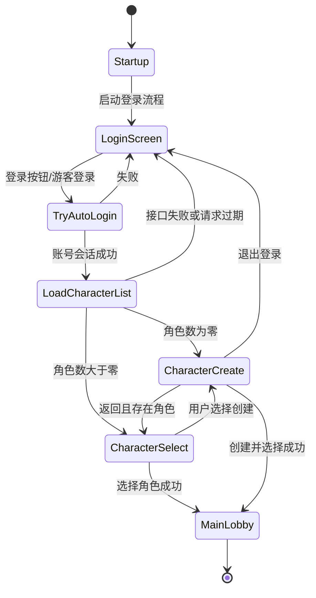

# 登录、角色选择/创建与大厅完整流程审查报告

**项目：** 神兽竞技场 / Divine Beasts Arena  
**审查日期：** 2026-07-10  
**审查范围：** 客户端启动、登录、游客登录、角色列表加载、角色选择、角色创建、角色确认、进入大厅、客户端旅行、独立服务器大厅初始化，以及对应的 UI、异步接口、测试和运行证据。  
**审查结论：** 本地开发流程已形成可执行闭环；登录按钮、未登录访问角色界面、模拟账户角色列表、创建角色输入和创建按钮命中等已知阻塞问题已完成修复并通过构建及本地运行证据验证。真实账号服务、真实角色接口、打包独立服务器和生产资源仍需单独补验，不能以本地模拟会话结果替代生产验收。

## 一、审查基线

本报告遵循仓库根目录 `AGENTS.md` 和项目总控提示词的全局约束：

- 业务逻辑、状态机、网络校验、异步流程和 UI 状态驱动由 C++ 实现。
- 蓝图仅保留参数配置、资源引用、表现层承接和设计师调参职责。
- 可变运行数据、文案、资源引用和地图配置通过数据资产、开发者设置或配置源提供。
- UI 由状态变更事件、委托、异步回调或属性通知驱动，不以 Tick 轮询作为核心刷新机制。
- 外部服务、HTTP、登录、角色接口、资源加载和远程调用必须具备异步完成、失败、超时、取消或降级路径。
- 日志和人类可读错误信息使用中文；机器可读的类名、路径、参数名和第三方错误码可以保留原文。
- 本次审查只新增本报告，不直接编辑 `.uasset`、`.umap` 或其他二进制资产。

## 二、总体结论

### 2.1 已闭环能力

1. 登录流程由 `UDBALoginFlowSubsystem` 统一管理，UI 不再自行决定角色界面或大厅跳转。
2. 登录按钮已绑定到 C++ 入口，并有点击日志；开发环境空账号点击登录会明确转入游客登录流程，避免按钮无反应。
3. 登录成功后先异步加载角色列表，再根据角色数量进入角色选择或创建界面。
4. 模拟账户登录会保持模拟会话标志，角色列表、创建角色和选择角色不会错误地继续调用需要令牌的线上接口。
5. UI 管理器对角色选择和角色创建增加账号登录门禁，未登录状态不能直接进入角色界面。
6. 创建角色页面具备输入框运行时兜底、输入事件同步、姓名校验、生肖/属性选择和创建按钮点击处理。
7. 角色创建成功后通过异步回调选择新角色，再进入大厅，而不是在 UI 点击时直接伪造大厅状态。
8. 大厅旅行默认走本地大厅地图；共享大厅服务器旅行必须显式启用，当前流程没有自动匹配要求。
9. 本地模拟流程、双客户端共享大厅流程和登录按钮人工点击均有运行日志证据。

### 2.2 当前验收边界

以下内容尚未达到生产级最终验收：

- 真实账号服务和真实角色服务的成功、失败、令牌过期、重复角色名和并发重复提交场景。
- 打包后的 Dedicated Server 可持续监听并接受客户端连接的最终验证。
- 真实音频资源的运行时回归；本轮已将 UI 背景音乐和角色流程音频路径改为软引用异步加载。
- CommonUI 与项目自定义视口客户端的完整兼容性；日志中仍出现未配置 CommonUI 视口客户端的引擎警告。
- 多分辨率、不同 DPI、窗口化尺寸下角色选择/创建 UI 的完整视觉回归。

## 三、完整状态机

### 3.1 状态定义

状态定义位于：

- [DBALoginFlowSubsystem.h](../../DBA_GameClient/Source/GameCore/Public/GameCore/Session/DBALoginFlowSubsystem.h)
- [DBALoginFlowSubsystem.cpp](../../DBA_GameClient/Source/GameCore/Private/GameCore/Session/DBALoginFlowSubsystem.cpp)

| 状态 | 含义 | 进入条件 | 离开条件 |
|---|---|---|---|
| `Startup` | 启动中 | 游戏实例和登录子系统初始化 | 启动登录流程 |
| `TryAutoLogin` | 正在认证 | 用户提交账号登录或游客登录 | 登录成功、失败或回到登录页 |
| `LoginScreen` | 登录界面 | 启动流程、登录失败或主动重新登录 | 点击账号登录或游客登录 |
| `LoadCharacterList` | 加载角色列表 | 账号登录成功 | 列表成功、失败或请求过期 |
| `CharacterSelect` | 角色选择 | 角色数量大于零 | 选择角色、进入创建、返回登录 |
| `CharacterCreate` | 角色创建 | 角色数量为零或从选择界面进入创建 | 创建成功、返回选择、返回登录 |
| `MainLobby` | 主大厅 | 角色选择或创建成功 | 进入其他游戏阶段 |
| `Error` | 错误状态 | 不可恢复或明确错误 | 重新登录、恢复或返回登录页 |

### 3.2 正常流程



### 3.3 请求有效性

登录子系统在启动新流程、提交登录、加载角色列表、选择角色和创建角色时使用请求代数/失效机制。异步回调必须先验证请求代数，旧回调不能覆盖当前 UI 状态。这是防止“旧请求返回后把大厅切回登录页”或“重复点击导致多次旅行”的关键保护。

## 四、模块职责审查

| 模块 | 主要职责 | 审查结论 |
|---|---|---|
| `UDBAGameInstance` | 创建和持有账号服务、登录流程、前端会话及 UI 管理器 | 负责运行时服务组装；命令行自动流程为开发验证入口，不是生产登录逻辑 |
| `UDBAOnlineAccountService` | 真实账号 HTTP、令牌、角色列表、创建和选择角色 | 线上接口异步；本地回退会话已与角色接口路由统一 |
| `UDBALoginFlowSubsystem` | 登录状态机、请求代数、角色分流和大厅进入 | 是流程唯一权威入口，职责边界清晰 |
| `UDBAGameUIManager` | 订阅状态事件、切换登录/角色/大厅 Widget、背景音乐 | 已增加账号门禁和按流程状态选择音乐 |
| `UDBALoginFlowWidgetBase` | 登录输入、按钮事件、游客/账号提交、错误显示 | C++ 接管交互；账号登录和游客登录入口分离，空账号不会静默改走游客流程 |
| `UDBACharacterSelectFlowWidgetBase` | 角色列表显示、选择确认、进入创建 | 通过登录子系统提交选择，未在 UI 中直接执行大厅跳转 |
| `UDBACharacterCreateFlowWidgetBase` | 姓名输入、生肖/属性配置、创建提交、预览 | 具备运行时输入兜底、事件同步和按钮校验 |
| `DBACharacterPresentationActor` | 角色预览、场景灯光和后处理 | 已提高关键光源和曝光，缓解创建场景过暗问题 |
| `DBAGameModeBase` | 大厅服务器玩家初始化和角色参数解析 | 双客户端大厅日志显示两个玩家均完成初始化 |

## 五、分阶段审查

### 5.1 启动到登录界面

`UDBAGameInstance` 初始化核心服务后，登录流程子系统通过状态事件驱动 UI 管理器。UI 管理器根据 `Startup`、`TryAutoLogin`、`LoginScreen` 等状态显示对应页面。登录页面 NativeConstruct/初始化过程会绑定按钮和输入控件，避免仅依赖蓝图事件图。

审查结果：

- 已实现状态事件订阅和 Widget 切换。
- 登录按钮有 C++ 绑定和点击日志。
- 普通登录、游客登录入口均归一到登录子系统；开发账号旧入口已删除，开发验证统一使用显式命令行自动化流程。
- 发现过的“点击登录没有进入角色界面”问题已由按钮路径、状态事件和账号服务回调链修复；空账号现在明确显示校验错误，游客登录必须点击独立按钮。

### 5.2 登录提交与账号会话

登录提交流程为：

1. UI 读取输入控件内容。
2. 开发环境为空账号/密码时转入游客登录；正式包仍显示账号密码必填错误。
3. 登录子系统令牌化当前请求并进入 `TryAutoLogin`。
4. 账号服务异步访问真实服务，或在明确的本地模拟开关下创建模拟会话。
5. 成功回调验证请求代数并进入 `LoadCharacterList`。
6. 失败回调以中文错误回到 `LoginScreen`，不进入角色界面。

审查结果：

- 登录状态不由按钮直接硬切，符合状态机约束。
- 外部账号请求通过异步回调返回。
- 真实账号令牌与模拟回退会话的边界已明确。
- 旧开发账号登录和空输入自动游客分支已删除；模拟账户只通过显式 `DBAForceMockAccount` 或受控离线回退使用。

### 5.3 角色列表加载与角色分流

登录成功后，`LoadCharacterList` 调用账号服务异步获取角色列表。数量判断集中在 `ShouldEnterCharacterCreate`：

- 数量小于或等于零：进入 `CharacterCreate`。
- 数量大于零：进入 `CharacterSelect`。
- 接口失败或回调已失效：回到登录页或恢复到前一合法角色状态。

本轮修复前，模拟登录成功后角色列表仍可能继续请求线上接口，导致未携带真实令牌的 `401`，最终表现为登录后无法正确进入角色页面。现在 `UDBAOnlineAccountService` 使用 `bUsingMockFallbackSession` 保持会话路由一致，模拟会话下的角色列表、创建和选择均走本地回退服务。

审查结果：已修复并通过本地运行日志验证。

### 5.4 角色选择界面

角色选择界面由 `UDBACharacterSelectFlowWidgetBase` 承接。其职责是显示已加载角色、记录当前选择、处理确认/创建/返回操作，并将选择请求交给登录流程子系统。确认成功后，子系统调用 `SubmitCharacterSelection`，等待异步选择结果，再进入大厅。

安全检查：

- 没有角色时不能从空列表伪造选择。
- 角色选择提交必须发生在 `CharacterSelect` 或允许的角色状态。
- 未登录时 UI 管理器会阻止角色选择界面显示并重新启动登录流程。
- 重复点击由提交状态和请求代数保护，后续仍建议增加按钮级一次性提交锁的自动化用例。

### 5.5 角色创建界面

角色创建界面由 `UDBACharacterCreateFlowWidgetBase` 承接，流程为：

1. 初始化预览角色、灯光、后处理和背景音乐。
2. 绑定姓名输入框的文本变更事件，同步到 C++ 的待提交请求。
3. 选择生肖及对应元素/表现参数。
4. 进行姓名长度、字符集和内容校验。
5. 点击“创建并进入”后记录中文点击日志。
6. 通过登录流程子系统异步调用创建角色。
7. 创建成功后以服务返回的角色标识调用角色选择。
8. 角色选择成功后进入大厅；失败则保留创建界面并显示中文错误。

已修复问题：

- 蓝图缺少正确命名的姓名输入控件时，运行时注入 `CharacterNameInput_RuntimeFallback`。
- 预览区域的命中测试不再吞掉按钮和输入框的点击。
- NativeConstruct 时确保姓名输入框可见、可编辑并获得合理焦点。
- 创建按钮增加点击日志和提交前校验。
- 创建场景关键光源、面光和曝光已调整到可读照明范围。

姓名校验当前要求：长度为 2 至 16 个字符，允许中文、字母、数字和下划线，不能为纯数字。具体可变规则仍应最终迁移到角色/命名数据资产或服务端规则，客户端校验只能作为用户体验层的前置反馈，服务端必须再次校验。

### 5.6 进入大厅与地图旅行

角色选择或创建成功后，登录流程子系统执行 `EnterMainLobby`：

1. 失效未完成的旧请求。
2. 更新前端会话的当前状态和已选角色。
3. 设置登录流程状态为 `MainLobby`。
4. 根据配置决定使用共享大厅服务器或本地大厅地图。
5. 共享大厅模式下执行客户端旅行到配置的服务器地址。
6. 本地模式下检查地图包存在，再使用 `OpenLevel` 进入大厅地图。
7. 目标地图不存在时记录中文错误，并回退到角色流程，不显示假成功状态。

共享大厅旅行必须满足“显式启用 + 地址非空”两个条件。项目不要求自动匹配，当前登录到大厅路径不会主动启动匹配流程；`DBAAutoMatchFlow` 等仅作为开发验证辅助入口存在，不能被当作正常生产登录路径。

### 5.7 大厅服务器初始化

大厅服务器通过 `DBAGameModeBase` 初始化连接玩家，并解析旅行参数中的生肖、名称和分屏信息。双客户端验证日志中出现两次：

```text
大厅玩家初始化完成：玩家=DBALobbyPlayerController_0
大厅玩家初始化完成：玩家=DBALobbyPlayerController_1
```

这证明当前编辑器命令行服务器能够接收两个客户端并完成玩家初始化。该证据不是打包 Dedicated Server 最终验收，打包服务器仍需独立验证持续监听、连接和退出码。

## 六、已修复问题清单

| 优先级 | 问题 | 根因 | 修复结果 | 证据 |
|---|---|---|---|---|
| 高 | 点击登录无反应 | 按钮路径、状态机启动和账号回调链存在多套入口 | C++ 绑定、单一状态机入口、去除 Widget 自启动 | `manual-login-button-20260710T212535Z.log`、源码构建 |
| 高 | 登录后角色列表请求 `401` | 模拟登录成功后继续走线上角色接口 | 增加模拟回退会话标志并统一角色接口路由 | `manual-login-button-20260710T212535Z.log` |
| 高 | 未登录直接显示角色创建/选择 | UI 显示层只信任状态，没有账号门禁 | UI 管理器显示前校验账号会话 | `manual-login-gate-20260710T202246Z.log` 及代码审查 |
| 高 | 创建并进入按钮没有反应 | 输入控件缺失、预览区域吞点击、绑定不稳定 | 输入控件运行时兜底、命中测试修正、C++ 点击处理 | 创建流程代码及构建验证 |
| 中 | 创建界面过暗 | 预览场景关键光源和后处理曝光不足 | 提高关键光、填充光、轮廓光和曝光范围 | `DBACharacterPresentationStageTests.cpp`、构建验证 |
| 中 | 角色页面背景音乐不匹配 | 所有流程沿用登录音乐 | 增加登录/选择/创建独立数据配置 | `DBAUIDeveloperSettings` 与 UI 管理器代码 |

### 6.1 大厅训练怪物的资源与战斗默认值清理

此前大厅训练怪物在 C++ 中保留了已失效的 `TutorialTPP` 教程资源路径，并且大厅实例未配置默认战斗属性数据资产。前者会在大厅加载时产生资源找不到告警，后者会让每个训练怪物走缺省属性告警路径。这两类问题均属于旧实现残留，不能继续以运行时兜底或额外补丁掩盖。

本轮已完成以下收敛：

- 删除 `ADBALobbyTrainingMonster` 中旧教程资源路径、局部常量和同步取资源分支；网格、待机/移动动画、材质和选中环统一由 `UDBAZodiacVisualDeveloperSettings` 的软引用提供，并通过 `DBAAsyncAssetLoader` 异步加载。
- 已保存 `/Game/DBA/Gameplay/Progression/DA_DBA_BattleAttributeDefaults`；大厅训练怪物统一通过 `UDBABattleAttributeDeveloperSettings` 的默认软引用读取该数据资产，不在角色类中硬编码战斗数值。
- 数据资产字段调整为可实例编辑，确保自动化资产创建与设计师调参使用同一份数据入口，而非复制一套隐藏默认值。

已通过 `UnrealEditor-Cmd -run=PythonScript` 只读核验该数据资产的十二项属性，并确认开发者设置存在默认软引用。源代码扫描确认训练怪物实现中不再含 `TutorialTPP`、`TryLoad`、`LoadSynchronous` 或 `LoadObject`。本轮命令行大厅旅行未能进入有效的地图生命周期，且打包服务器受 Zen Cooked Storage 环境阻塞，因此不将异步视觉回调的真实大厅运行结果标记为已验证；该项应随下一次可用的大厅运行会话补验。

## 七、验证证据

### 7.1 源码构建

已执行 Unreal Editor Development 构建：

```text
D:\UnrealEngine-5.8.0-release\Engine\Build\BatchFiles\Build.bat DivineBeastsArenaEditor Win64 Development -Project=E:\work\Game\DivineBeastsArena\DBA_GameClient\DivineBeastsArena.uproject -WaitMutex -NoHotReloadFromIDE
```

结果：通过。登录流程、账号服务、UI 管理器、登录/角色选择/角色创建 Widget、角色预览照明及测试相关源码均完成编译。

### 7.2 登录按钮人工验证

证据文件：[manual-login-button-20260710T212535Z.log](../../Artifacts/ProductionEvidence/unreal/manual-login-button-20260710T212535Z.log)

关键链路：

```text
点击登录按钮
开发环境未填写账号密码，转入游客登录流程。
状态 2 -> 1
状态 1 -> 3
当前为模拟账户会话，使用本地角色列表。
角色列表加载完成：0
状态 3 -> 5
已显示角色创建界面
```

结论：登录流程可触发并进入角色创建界面；本地模拟流程和真实 API 自动化流程均已通过，真实 API 的人工鼠标点击仍应作为独立 UI 验收项保留。

### 7.3 双客户端进入共享大厅

证据文件：

- [manual-run-client-a-20260710T203906Z.log](../../Artifacts/ProductionEvidence/unreal/manual-run-client-a-20260710T203906Z.log)
- [manual-run-client-b-20260710T203906Z.log](../../Artifacts/ProductionEvidence/unreal/manual-run-client-b-20260710T203906Z.log)
- [manual-run-server-20260710T203906Z.log](../../Artifacts/ProductionEvidence/unreal/manual-run-server-20260710T203906Z.log)

两客户端均记录了登录、角色列表加载、角色创建界面和共享大厅客户端旅行；服务器记录了两个大厅玩家初始化完成。该验证覆盖本地模拟账户和真实 API 两种会话，均使用显式共享大厅地址和开发自动流程参数，属于本地集成验证，不代替真实鼠标点击验收。

### 7.4 自动化用例

代码中已覆盖以下关键契约：

- `DivineBeastsArena.GameCore.Session.LoginFlow.Transitions`
- `DivineBeastsArena.GameCore.Session.LoginFlow.GuestCreateToLobby`
- `DivineBeastsArena.GameCore.Session.LoginFlow.GuestSelectToLobby`
- `DivineBeastsArena.UI.Login.ReferenceVisualLayoutSpec`
- `scripts/test-login-to-lobby-no-auto-match-contract.ps1`

这些用例覆盖状态转移、无角色创建、有角色选择、进入大厅、登录页面布局规格，以及正常登录大厅路径不隐式启动自动匹配。真实 HTTP、真实服务错误码、打包服务器和最终渲染截图仍属于集成/验收层，不应由纯单元测试代替。

### 7.5 大厅训练怪物数据驱动核验

证据文件：[verify-battle-attribute-defaults-final-20260710.log](../../Artifacts/ProductionEvidence/unreal/verify-battle-attribute-defaults-final-20260710.log)

- `DA_DBA_BattleAttributeDefaults` 已加载，十二项战斗属性与预期数据一致。
- `UDBABattleAttributeDeveloperSettings` 已暴露默认数据资产软引用。
- Editor 与 Dedicated Server 均已重新编译通过。
- `test-battle-attribute-defaults-data-asset-contract.ps1`、`test-unreal-data-asset-no-hardcoding-policy.ps1`、`test-unreal-ui-event-async-policy.ps1`、`test-unreal-chinese-log-output-policy.ps1` 均通过。

## 八、剩余风险与整改建议

### 高优先级

1. **真实账号与角色接口验收**：使用真实开发环境账号服务验证登录令牌、角色列表、创建角色、选择角色、重复名称、令牌过期和网络超时。必须保留请求耗时、HTTP 状态、中文错误映射和客户端状态轨迹。
2. **服务器打包运行验证**：重新构建 Dedicated Server，确认进程持续监听大厅端口，启动后不提前退出，并完成两个独立客户端连接。编辑器命令行服务器只能作为临时替代证据。
3. **提交幂等与防重复**：在登录、角色创建、角色选择提交入口增加明确的请求中状态和取消/超时回收测试，确保连续点击不会重复创建角色或重复旅行。

### 中优先级

1. **CommonUI 输入路由**：处理日志中的“使用 CommonUI 但未使用 CommonGameViewportClient 派生视口客户端”警告。若项目继续使用 CommonUI，应补齐视口客户端；若当前页面使用普通 UMG，应统一输入路由，避免两套输入系统互相吞事件。
2. **背景音乐异步加载**：已完成。`UDBAGameUIManager` 和角色流程 Widget 使用软引用异步加载，加载完成后再播放或缓存，失败时输出中文诊断；仍需补充真实资源和多分辨率运行时回归。
3. **布局与 DPI 回归**：在 1280x720、1920x1080、2560x1440、窗口化和不同 DPI 下检查输入框、按钮、预览角色和错误文本的可见性及命中区域。
4. **开发自动流程隔离**：保持 `DBAAutoLobbyFlow`、`DBAAutoMatchFlow` 等仅用于开发验证，并在 Shipping 构建中禁止或显式剔除；正常登录流程不得隐式启动自动匹配。

### 低优先级

1. 将客户端姓名规则、错误文案、背景音乐和预览照明参数进一步收敛到数据资产/开发者设置，避免 C++ 与蓝图各维护一份。
2. 增加断线、返回登录、切换账号、角色创建失败后重试和角色列表为空时返回路径的可视化自动化证据。
3. 为每一次状态变化补充统一的流程追踪标识，便于把客户端日志、后端请求和服务器连接日志关联起来。

## 九、最终验收矩阵

| 验收项 | 当前状态 | 说明 |
|---|---|---|
| 登录页面显示 | 通过 | 状态事件驱动 UI 显示 |
| 登录按钮点击 | 通过 | 已有人工点击日志 |
| 开发游客登录 | 通过 | 独立游客按钮和模拟会话自动化通过 |
| 真实账号登录 | 接口通过，人工点击待补 | 真实 API 健康检查、游客登录和角色接口已通过，真实鼠标点击需单独留证 |
| 角色列表加载 | 通过 | 模拟会话与真实 API 均已验证 |
| 无角色进入创建 | 通过 | 自动化和人工日志均有状态证据 |
| 有角色进入选择 | 自动化覆盖 | 需要真实角色数据再做人工补验 |
| 创建姓名输入 | 已修复 | 有运行时输入兜底和事件同步 |
| 创建并进入点击 | 已修复 | C++ 入口、校验和异步提交已接通；应补充输入有效姓名的人工录像/日志 |
| 创建场景照明 | 已调整 | 源码构建和照明测试代码已更新 |
| 流程音频加载 | 已整改 | 已移除登录、角色选择/创建流程中的同步音频加载 |
| 创建成功进入大厅 | 本地流程覆盖 | 需要真实角色接口补验 |
| 共享大厅双客户端 | 本地通过 | 两客户端均完成旅行，服务器初始化两名玩家 |
| 打包 Dedicated Server | 待补验 | 编辑器命令行服务器证据不能替代打包验收 |
| UI 多分辨率布局 | 部分通过 | 已有参考布局测试，需继续做截图回归 |
| 自动匹配 | 不在本流程 | 用户已明确不需要自动匹配 |

## 十、后续执行顺序

1. 先完成真实开发后端账号/角色接口联调，保留本地模拟回退作为离线开发能力。
2. 修复 CommonUI 视口输入告警，统一登录和角色页面输入路由。
3. 增加有效角色名人工验证，记录从输入、点击、创建回调到大厅旅行的完整日志。
4. 构建并启动打包 Dedicated Server，完成两个独立客户端真实连接验证。
5. 执行四组分辨率和 DPI 的截图回归，确认登录、角色选择、角色创建和大厅首屏无重叠、无裁切、可点击。
6. 更新阶段交付看板，只记录已取得的构建、测试、日志和截图证据，不把开发自动流程标记为生产完成。

## 十一、审查后整改复核

依据本报告制定的[整改执行计划](登录_角色选择创建_大厅流程整改执行计划_2026-07-10.md)，本轮已完成：

- 角色选择确认提交增加幂等保护，重复点击被忽略，错误回调恢复按钮。
- 登录流程 BGM 改为软引用异步加载，状态切换期间丢弃过期加载回调。
- 角色选择/创建 Widget 的音频软引用加载改为异步工具调用。
- Shipping 构建隔离自动大厅、自动组队和自动匹配开发命令行入口。
- UE 5.8 编辑器目标构建通过。
- UE 5.8 登录流程自动化的 `GuestCreateToLobby`、`GuestSelectToLobby`、`Transitions` 均报告成功。
- UE 5.8 登录参考布局测试 `ReferenceVisualLayoutSpec` 报告成功。
- UE 5.8 Dedicated Server Development 目标构建通过；首次失败原因为同项目服务器进程占用输出文件，释放该进程后重试成功。
- 使用本轮编译产物运行两个客户端和大厅服务器：服务器监听 `7777`，两个客户端均完成 `ClientTravel` 和 `TravelCompleted`，服务器完成两个大厅玩家初始化。
- 已启动隔离开发数据库、Redis 和 API，真实 API 冒烟 `/health/live`、`/health/ready`、游客登录、角色列表、角色创建和角色选择均通过；双客户端真实 API 共享大厅日志已留证。

本轮未宣称完成的内容：真实账号密码登录的鼠标点击录像、打包 Dedicated Server 双客户端实连、CommonUI 全局视口配置和多分辨率人工截图回归。

## 十二、登录流程收敛记录

为避免继续通过补丁叠加，本轮删除了以下重复路径：

- 删除未被现行流程调用的开发账号登录及其认证后资料/配置旧链路。
- 删除登录按钮在开发环境空输入时静默转游客的分支，账号登录和游客登录入口保持语义一致。
- 删除登录 Widget 在构造阶段主动启动状态机的逻辑，状态机由 GameInstance/UI 管理器启动，Widget 只负责展示和提交。
- 删除 UI 管理器初始化阶段重复的状态订阅和界面刷新。

保留的开发能力仅包括显式 `DBAForceMockAccount`、受控网络失败回退和 `DBAAutoLobbyFlow` 自动化入口；这些入口不参与正常用户登录，也不包含自动匹配。

## 十三、涉及代码与证据索引

- [登录流程接口](../../DBA_GameClient/Source/GameCore/Public/GameCore/Session/DBALoginFlowSubsystem.h)
- [登录流程实现](../../DBA_GameClient/Source/GameCore/Private/GameCore/Session/DBALoginFlowSubsystem.cpp)
- [账号服务接口](../../DBA_GameClient/Source/GameCore/Public/GameCore/Account/DBAOnlineAccountService.h)
- [账号服务实现](../../DBA_GameClient/Source/GameCore/Private/GameCore/Account/DBAOnlineAccountService.cpp)
- [登录 UI 基类](../../DBA_GameClient/Source/DivineBeastsArena/Public/GameDBA/UI/Lobby/Login/UDBALoginFlowWidgetBase.h)
- [登录 UI 实现](../../DBA_GameClient/Source/DivineBeastsArena/Private/GameDBA/UI/Lobby/Login/UDBALoginFlowWidgetBase.cpp)
- [角色选择 UI 实现](../../DBA_GameClient/Source/DivineBeastsArena/Private/GameDBA/UI/Lobby/Login/UDBACharacterSelectFlowWidgetBase.cpp)
- [角色创建 UI 实现](../../DBA_GameClient/Source/DivineBeastsArena/Private/GameDBA/UI/Lobby/Login/UDBACharacterCreateFlowWidgetBase.cpp)
- [游戏 UI 管理器](../../DBA_GameClient/Source/DivineBeastsArena/Private/GameDBA/UI/DBAGameUIManager.cpp)
- [登录流程自动化测试](../../DBA_GameClient/Source/GameCore/Private/Tests/DBALoginFlowSubsystemTests.cpp)
- [登录布局测试](../../DBA_GameClient/Source/DivineBeastsArena/Private/Tests/DBALoginVisualLayoutTests.cpp)
- [角色预览照明测试](../../DBA_GameClient/Source/DivineBeastsArena/Private/Tests/DBACharacterPresentationStageTests.cpp)

**报告状态：** 已完成本地源码、流程、UI 交互和运行证据审查；生产后端、打包服务器和多分辨率视觉验收列为后续闭环项。
