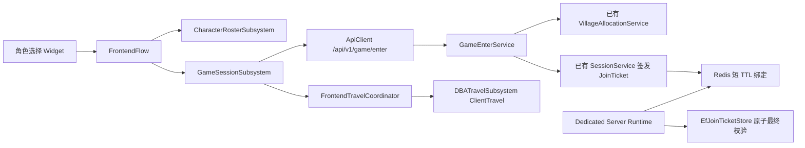

# 步骤 26：GameSession、EnterWorld Ticket 与客户端交接

## 本步骤的迁移结论

| 现有实现 | 目标实现 | 迁移办法 |
| --- | --- | --- |
| `/api/sessions/village-allocation` + `GET /api/sessions/{id}/connection` | `POST /api/v1/game/enter` | 新端点复用既有 Village 分配、Dedicated Server 编排和连接签发，不新建平行会话模型。 |
| `UDBAFrontendFlowSubsystem` 内部直接轮询 Village、拼接 Travel URL、调用 `ClientTravel` | `UDBAGameSessionSubsystem` + `UDBAFrontendTravelCoordinator` | 角色选择的新运行路径只调用 `GameSessionSubsystem`；旧私有 Village 方法保留为未被新路径调用的兼容代码，等待既有大厅链路迁移后删除。 |
| PostgreSQL `EfJoinTicketStore` 一次性条件更新 | PostgreSQL 最终权威 + Redis 短期绑定索引 | 同一 JoinTicket 的哈希写入 Redis，Runtime 使用单键 Lua `GET + DEL` 原子拒绝重复，再由 PostgreSQL 执行完整上下文条件更新。 |

## 唯一职责



- `FrontendFlow`：只负责从 `CharacterSelect` 进入 `EnteringWorld`，以及失败时回退 `CharacterSelect`；不拼地址、不持有 Ticket。
- `UDBAGameSessionSubsystem`：以 `CharacterId + ServerId` 调用唯一 HTTP 端点，处理 `PENDING` 重试、请求取消与响应 DTO 解析。
- `UDBAFrontendTravelCoordinator`：在旅行前开启全局 Loading、阻止前台交互、释放 Preview，再调用 `UDBATravelSubsystem`。它是新前台链唯一允许发起 `ClientTravel` 的对象。
- `GameEnterService`：依据 AccessToken 的 `player_id` 复核角色归属、区服、角色未删除状态；选择/分配当前开发 Dedicated Server，并复用既有连接签发。
- `GameTicketRedisRegistry`：存储同一张签发票据的哈希绑定（账号、角色、会话、DS 实例、构建），TTL 等于票据 TTL；不签发第二套票据。
- `EfJoinTicketStore`：继续是最终的持久化原子消费权威。`TeamId` 仍来自会话队伍/槽位，绝不由 Zodiac、Element 或 FiveCamp 推导。

## `/api/v1/game/enter` 契约

请求必须已认证：

```json
{ "characterId": "UUID", "serverId": "UUID" }
```

`PENDING` 不含票据，表示 DS 正在启动，客户端使用相同意图在配置的退避间隔后重试。`READY` 的 `connection` 内含短生命周期的 `joinTicket`。该 Ticket 只用于 Dedicated Server 准入，不能替代 AccessToken，也不进入日志、Widget、ViewModel 或 `FDBAFrontendSessionContext`。

## 失败与清理

- 角色不归属、区服不匹配、角色已删除：后端拒绝，Flow 恢复角色选择。
- DS 未就绪：返回 `PENDING`，仅 `GameSessionSubsystem` 重试；不会阻塞 GameThread。
- 旅行启动失败：TravelCoordinator 关闭自己的 Loading token，Flow 使用结构化错误回到角色选择。
- 换服、登出、Token 过期、网络中断、应用挂起：Flow 的统一失效入口取消 GameSession 请求，因此旧回调不会触发旅行。
- 同一 Ticket 的第二次 Runtime consume：Redis 已原子删除，随后请求被拒绝；PostgreSQL 的条件更新仍防御 Redis 以外的重放与绑定篡改。

## 人工审核准备

工程环境具备 PostgreSQL、Redis、API、开发 Dedicated Server 与可见客户端窗口后：登录、选择某一区服和角色、点击“进入游戏”；人工确认 Loading 出现、前台 Preview 释放、首次进入成功、同一 Ticket 第二次 Runtime 提交失败，以及旅行启动失败后仍回到角色选择。不得使用自动登录、自动选角、自动 Travel 或脚本验收。
