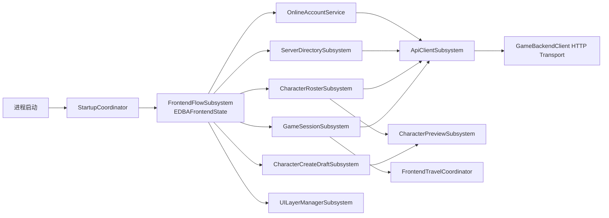

# 步骤29：启动到角色创建最终架构

## 结论

源码层已经形成一条唯一的新前台业务链。`EDBAFrontendState` 是 Screen/业务流转的 canonical 状态，`UDBAFrontendFlowSubsystem` 是唯一状态提交者；网络、区服、角色列表、创建草稿、预览和进入游戏均由专属 Subsystem 承担。旧对象只作为已有二进制 UI、旧大厅或已发布 API 的兼容适配器，不得成为新调用入口。

本次没有删除 `.uasset`、`.umap` 或运行时源码对象。原因是步骤27报告没有人工 E2E通过结论，且当前环境未完成 Editor Reference Viewer/Fix Redirectors；这不满足“无引用、已有替代、E2E 已覆盖”三项删除门槛。

## 最终运行链



## 状态与返回规则

唯一状态集合位于 `EDBAFrontendState`：

```text
Bootstrapping -> Startup -> AutoLogin/Login/Register
-> ServerSelect -> CharacterRosterLoading -> CharacterSelect
-> CharacterCreate_Zodiac -> CharacterCreate_Element
-> CharacterCreate_FiveCamp -> CharacterCreate_Confirm
-> EnteringWorld
```

`RecoverableError` 与 `FatalError` 只由 Flow 统一处理。Logout、TokenExpired、换服、删除角色、创建取消、网络中断和 Travel 失败均先清理对应 Session/Cache/Draft/Preview，再由状态转换表决定回退页面。

`EDBALoginFlowState`、`EDBAFrontendStep` 与 `UDBAFrontendFlowController` 已正式标记 Deprecated，只允许把 canonical 状态投影给旧 UMG/大厅代码。新状态、新 Guard 和新 Screen 不得写入这些兼容类型。

## UI 树与职责

```text
UDBAUILayerManagerSubsystem
└─ UDBAUIRootLayout（唯一 Viewport Root）
   ├─ BackgroundLayer
   ├─ ScreenLayer
   ├─ ModalLayer
   ├─ ToastLayer
   ├─ TooltipLayer
   └─ DebugLayer
```

- Widget：布局、动画、输入与显示绑定。
- ViewModel：FieldNotify/MVVM 显示状态。
- WidgetController：把 UI 意图交给 Flow/Domain Subsystem，订阅结果事件。
- Subsystem：业务、缓存、异步取消、跨地图生命周期。

`UDBAGameUIManager` 仍承载大厅/对局 HUD 和旧前台资产的兼容挂载，不能删除；其登录 Flow 的显示入口已标记 Deprecated。新前台 Screen 只能通过 Flow + `UDBAUILayerManagerSubsystem` 激活。

## 角色创建

`UDBACharacterCreateDraftSubsystem` 是未创建角色的唯一草稿 Owner：

```text
Zodiac + Appearance
  -> Element + FixedBuild Preview
  -> FiveCamp + Presentation Theme
  -> Confirm + Name
  -> CharacterRosterSubsystem.CreateCharacter
```

Draft 只保存稳定 ID 和显示摘要，不保存任意资产路径或服务端角色实体。服务端最终校验角色槽、名称、生肖、元素、FiveCamp、固定构筑和外观合法性。创建成功后清 Draft、更新 Roster、选择新角色并由 Flow 返回 CharacterSelect；失败时保留 Draft。

## Canonical 类型

| 概念 | Canonical | 兼容类型 | 规则 |
| --- | --- | --- | --- |
| 生肖 | `EDBAZodiac` | `EDBAZodiacType` | 仅经 `DBAIdentityTypeAdapter` 读取旧值 |
| 元素 | `EDBAElement` | `EDBAElementType` | 仅经 Adapter 迁移 |
| FiveCamp | `EDBAFiveCamp` | `EDBAFiveCampType` | UI/Domain/DTO 新路径只用 canonical 类型 |
| 前台状态 | `EDBAFrontendState` | `EDBALoginFlowState`、`EDBAFrontendStep` | 兼容类型只读、不可扩展 |
| 队伍 | 会话中的 `TeamId` | 无 | 不从 Zodiac/Element/FiveCamp 推导 |

代码与后端运行主链未发现 `Faction`、`FactionSelect` 或 `DivinePantheon` 类型。文档和数据校验中的这些词仅作为禁止项/迁移哨兵存在。

## 后端边界

生产外部契约为：

- `/api/v1/auth/*`
- `/api/v1/servers`
- `/api/v1/characters`
- `/api/v1/game/enter`

玩家名初始化不再隐式挂在 `/api/v1/auth/login`：`AuthService` 只认证和签发 Token。UE 注册成功后的首次认证编排使用 AccessToken 调用 `/api/v1/auth/player-name/generate`，普通账号登录与 Refresh 不调用该接口。

`GameDbContext` 是唯一 EF Core DbContext。PostgreSQL 保存账号、Profile、角色、外观、进度、区服和会话权威数据；Redis 只用于缓存、短期 Session/Ticket 与一次性 consume 索引。

已有 successor 的 `/api/auth` 路径、`/api/account/characters` 与 `/api/players/me/characters` 返回 Deprecated 响应头。它们仍复用现有应用层/数据库，不允许复制新的规则或 DTO 权威。

## Dedicated Server 边界

- `UDBAUILayerManagerSubsystem` 与 `UDBACharacterPreviewSubsystem` 在子系统创建阶段排除 Dedicated Server。
- DS 不创建 UMG/CommonUI Root，不进入前台预览 Stage，不加载前台 Niagara/SFX/Mesh。
- 当前 `DivineBeastsArena` 主模块仍因历史公开类型保留 UMG/Slate/Niagara 编译依赖；这属于待拆 Client-only 模块的构建图风险，不能误写成运行时 UI 已进入 DS。

## 地图与资产真实状态

当前 Config 仍将 `GameDefaultMap`、`BootMap` 和 `FrontendMap` 指向 `/Game/Maps/Lobby/FrontendMap`。源码已有 `ADBABootGameMode` 和 Startup Coordinator，但尚未拥有已验证的独立 `L_DBA_Boot` / `L_DBA_Frontend` 二进制地图，因此最终文档以当前可追溯路径为准，不虚构资产已经迁移。

`DA_DBA_UIFlowRegistry` 的二进制字符串证据显示 CharacterSelect/Create 当前指向 `/Game/DBA/UI/Lobby/Character/*`。`/Game/DBA/UI/Frontend/Character/*` 同名资产仍存在，但在 Editor 证明无引用并完成 Fix Redirectors 前不可删除。

## 工程验证记录

- UE5.8 `DivineBeastsArenaEditor Win64 Development`：成功。
- UE5.8 `DivineBeastsArenaServer Win64 Development`：成功；构建图仍报告第三方 `StructUtils` 已废弃告警。
- .NET 10 `dotnet build GameBackend.sln --no-restore`：成功，0 警告、0 错误。
- 后端测试：`Game.ServerManagement.Tests` 5/5、`Game.IntegrationTests` 2/2 通过；`Game.Api.Tests` 97/184 通过。失败项集中在既有 InMemory 事务警告、WebApplicationFactory 未建 Host 与一项中文错误文本期望，不能写成全绿。
- 未执行自动 E2E smoke，也未取得人工运行验收结论；因此本步骤仍不删除二进制资产或 Legacy 运行时对象。
