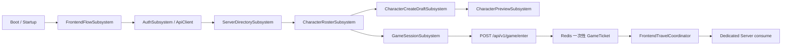

# 步骤27：启动至角色创建/选择端到端联调报告

日期：2026-08-09
范围：`DBA_GameClient` 前台链路、`DBA_GameBackend` 账号/区服/角色/入服链路。
审核结论：**尚未进行运行人工审核；当前工作区不具备启动 UE 5.8 Editor 或 .NET 10 SDK 的条件，且仓库规则禁止自动代替用户完成登录、选角、创建或 ClientTravel。**

## 1. 结论与本次最小修复

本阶段停止增加新的前台业务能力，只修复并记录了两个会影响真实链路的断链风险：

1. `UDBAFrontendTravelCoordinator` 现在在调用 `RequestClientTravel` **之前**注册 `PostLoadMapWithWorld`。本地/缓存地图极快完成加载时不再漏掉回调，从而避免全局 Loading 请求令牌残留。
2. `EfSessionAdmissionStore` 现在优先使用本次 `PlayerSession.CharacterId` 的冻结值签发入服连接信息。不会在换服后从账号全局的最近选中角色取回另一服角色的构筑；仅保留未冻结旧会话的兼容回退。

`POST /api/v1/game/enter`、Redis 一次性 GameTicket、`UDBAGameSessionSubsystem` 与 `UDBAFrontendTravelCoordinator` 均沿用步骤26已有的唯一新链路；角色选择成功后的 Flow 已调用该链路，不再由该路径直接拼接服务器地址或调用旧 Travel。

## 2. 审计发现与迁移判断

| 能力 | 当前权威实现 | E2E 判断 | 处理 |
|---|---|---|---|
| 前台状态流 | `UDBAFrontendFlowSubsystem` | 已静态确认涵盖 Login、ServerSelect、CharacterRosterLoading、四步创建、EnteringWorld | KEEP |
| 前台会话 | `FDBAFrontendSessionContext`、`UDBAFrontendFlowSubsystem` | AccountId / ServerId / SelectedCharacterId 均为摘要，未在 Widget 保存 Token | KEEP |
| 角色 HTTP | `UDBACharacterRosterSubsystem` → `/api/v1/characters` | 请求携带 ServerId，缓存绑定 AccountId + ServerId，具有 generation 保护 | KEEP |
| 角色权威 API | `CharacterEndpoints` + `ICharacterRosterService` | 按 ServerId 读取/创建，删除为 SoftDelete，创建使用 Idempotency-Key | KEEP |
| 预览 | `UDBACharacterPreviewSubsystem` | 控制器使用弱引用和请求代次；需人工快速 Tiger/Dragon 切换确认资源回调 | KEEP，人工审核 |
| 入服 | `UDBAGameSessionSubsystem` → `POST /api/v1/game/enter` | 仅提交角色/区服意图，票据仅作瞬态 Travel 参数 | KEEP |
| DS 入场校验 | `GameTicketRedisRegistry` + `EfJoinTicketStore` | Redis 原子消费后仍由 PostgreSQL 进行最终消费校验 | KEEP，需 Redis/DS 人工审核 |
| 旧 Village Travel | `DBAFrontendFlowSubsystem::RequestVillageAllocation` 等兼容私有函数 | 新 CharacterSelect 路径未调用，但遗留代码仍存在 | DEPRECATE，后续收尾删除 |
| 启动地图 | `DefaultEngine.ini` / `DBAFrontendSettings` | 仍指向 `/Game/Maps/Lobby/FrontendMap`，没有发现 `L_DBA_Boot`、`L_DBA_Frontend` 资产 | BLOCKED，见第5节 |

## 3. 静态链路追踪

关键边界：

- Widget 只把点击意图交给 Controller / Flow / Subsystem；没有在新角色链路中直接请求 HTTP、保存 Token 或直接 Travel。
- `TeamId` 只沿用既有 DS 会话协议，不从 Zodiac、Element 或 FiveCamp 推导。
- FiveCamp 仍可通过既有 DivinePantheon 兼容映射提供表现，未重新引入 Faction。
- Travel URL 和 GameTicket 不写入日志；AccessToken 不作为 DS 票据。

## 4. 人工运行审核清单

以下清单必须由人工在可见 Editor/客户端窗口完成。每一项记录截图、客户端日志时间段、API CorrelationId（不记录 Token/Ticket）和结论；本报告不把静态检查或测试代码视为用户体验验收。

| 顺序 | 人工操作 | 期望结果 | 状态 |
|---:|---|---|---|
| 1 | 冷启动客户端 | 从 Boot 到持久 Frontend，无黑屏、无第二个 UI Root | 待环境就绪 |
| 2 | 无 Token 进入 Startup | 显示 Startup，继续后进入 Login | 待环境就绪 |
| 3 | 注册测试账号并登录 | 仅一笔登录业务请求，Flow 进入 ServerSelect | 待环境就绪 |
| 4 | 选择 Online 区服 | SessionContext 写入该 ServerId，加载该服空角色列表 | 待环境就绪 |
| 5 | 创建 Tiger，修改合法 Appearance，选择 Element 与 FiveCamp，输入名称并提交 | 创建成功一次；返回 CharacterSelect；新角色被选中 | 待环境就绪 |
| 6 | 快速切换 Tiger / Dragon / Tiger | 3D 预览最终只显示最后一次选择，旧异步回调不得覆盖 | 待环境就绪 |
| 7 | 退出后再次启动和登录 | 同 ServerId 能读取角色，Appearance 与创建时一致 | 待环境就绪 |
| 8 | 创建 Dragon，切换两角色，删除其一后 Refresh | 删除角色不再出现；SelectedCharacter 与 Preview 均无悬挂引用 | 待环境就绪 |
| 9 | 换服、登出、Android Suspend/Resume | 不串角色/预览/草稿；恢复不重复初始化 UI Root | 待环境就绪 |
| 10 | 选择角色进入游戏 | 获得短 TTL 一次性 Ticket；DS 可用则连接，Travel 失败则恢复 CharacterSelect | 待环境就绪 |
| 11 | 人为断网、API 500、TokenExpired、维护服 | 显示结构化可恢复错误；刷新失败统一登出；不无限弹窗 | 待环境就绪 |

## 5. 当前阻塞项与前置条件

1. `DBA_GameClient/Config/DefaultEngine.ini` 的 `GameDefaultMap` 仍为 `/Game/Maps/Lobby/FrontendMap.FrontendMap`，`DefaultGame.ini` 的 BootMap 和 FrontendMap 也均为该旧地图。
2. `Content` 中未发现 `L_DBA_Boot.umap` 或 `L_DBA_Frontend.umap`。按仓库规则不能直接编辑或伪造 `.umap`，必须由具备 UE 5.8 Editor 的人员创建/整理资产并 Save，然后将配置改为真实软路径。
3. 当前机器未发现 UE 5.8/UnrealBuildTool，且 `dotnet --list-sdks` 为空；因此不能编译 Editor、启动 .NET 10 API 或进行运行人工审核。
4. `DivineBeastsArena.Build.cs` 的 `UMG`、`Slate`、`SlateCore`、`Niagara` 仍是公开依赖，Server 目标的纯前台依赖隔离尚未完成；这不是本次新增问题，但会阻塞 Dedicated Server 构建边界验收。
5. 既有 `DBAZodiacSkillVFXComponent_Generic.cpp` 存在 Unity 编译下的重复匿名辅助函数/签名冲突，属于前台链路外的既有 Editor 编译阻塞，未在本阶段扩大修复范围。

## 6. 测试契约与执行状态

新增/补强的自动化测试契约：

- `GameEnterServiceTests.EnterAsync_WhenCharacterServerDoesNotMatch_RejectsBeforeAllocation`
- `GameEnterServiceTests.EnterAsync_WhenDedicatedServerIsStillStarting_ReturnsPendingWithoutTicket`
- `GameEnterServiceTests.EnterAsync_WhenCharacterHasNotBeenSelected_RejectsBeforeAllocation`

这些测试均不自动驱动客户端业务流程；当前未执行，原因是本机没有 .NET SDK，并且仓库的人工审核策略禁止用自动化操作替代注册、登录、创建角色、选角或 ClientTravel 的人工结论。

已完成工程检查：`git diff --check` 通过。后续在安装 .NET 10 SDK 后可先进行后端编译检查；在 UE 5.8 环境完成地图资产后，再按第4节由人工执行可见运行审核。
